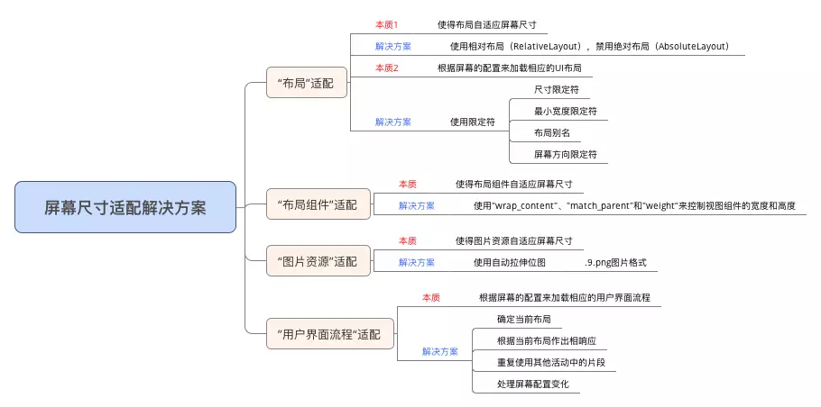

# Android屏幕适配

https://www.jianshu.com/p/ec5a1a30694b

## 定义

使得某一元素在Android不同尺寸，不同分辨率的手机上具备相同的显示效果。

## 概念

### 屏幕尺寸

- 含义：手机对角线的物理尺寸
- 单位：英寸inch，1英寸=2.54cm

```text
Android手机常见的尺寸有5，5.5，6等等
```

### 屏幕分辨率

- 含义：手机在横向，纵向上的像素点数总和

```text
1.一般描述成屏幕的"宽X高" = AxB
2.含义：屏幕在横向方向（宽度）上有A个像素点，在纵向方向（高）有B个像素点
3.例子：1080x1920，即宽度方向上有1080个像素点，在高度方向上有1920个像素点
```

- 单位：px（pixel），1px = 1像素点

```text
UI设计师的设计图会以px作为同意的计量单位
```

- Android手机常见的分辨率:320x480,480x800,720x1280,1080x1920

### 屏幕像素密度

- 含义：每英寸的像素点数
- 单位：dpi（dots per inch）

```text
假设设备内每英寸有160个像素，那么该设备的屏幕像素密度=160dpi
```

- 安卓手机对于每类手机屏幕大小都有一个相应的屏幕像素密度

| 密度类型           | 代表的分辨率（px) | 屏幕像素密度(dpi) |
| ------------------ | ----------------- | ----------------- |
| 低密度(ldpi)       | 240x320           | 120               |
| 中密度(mdpi)       | 320x480           | 160               |
| 高密度(hdpi)       | 480x800           | 240               |
| 超高密度(xhdpi)    | 720x1280          | 320               |
| 超超高密度(xxhdpi) | 1080x1920         | 480               |

### 屏幕尺寸，分辨率，像素密度三者关系

一部手机的分辨率是宽x高，屏幕大小是以寸为单位，那么三者的关系是


### 密度无关像素

- 含义：density-independent pixel, 叫dp或dip,与终端上的实际物理像素点无关
- 单位：dp。可以保证在不同屏幕像素密度的设备上显示相同的效果

```text
1.Android开发时用dp而不是用px单位设置图片的大小，是Android特有的单位
2.场景：假如同样都是画一条长度是屏幕一半的线，如果使用px作为计量单位，那么在480x800分辨率手机上设置应为240px，在320x480的手机上应设置为160px，二者设置就不同了；如果使用dp为单位，在这两种分辨率下，160dp都显示为屏幕一般的长度
```

- dp与px的转换

  因为ui设计师给你的设计图是以px为单位的，Android开发则是使用dp作为单位的，那么我们需要进行转换

  | 密度类型           | 代表的分辨率(px) | 屏幕密度(dpi) | 换算(px/dp) | 比例 |
  | ------------------ | ---------------- | ------------- | ----------- | ---- |
  | 低密度(ldpi)       | 240x320          | 120           | 1dp=0.75px  | 3    |
  | 中密度(mdpi)       | 320x480          | 160           | 1dp=1px     | 4    |
  | 高密度(hdpi)       | 480x800          | 240           | 1dp=1.5px   | 6    |
  | 超高密度(xhdpi)    | 720x1280         | 320           | 1dp=2px     | 8    |
  | 超超高密度(xxhdpi) | 1080x1920        | 480           | 1dp=3px     | 12   |

  在Android中，规定以160dpi（即屏幕分辨率为320x480）为基准：1dp=1px

### 独立比例像素

- 含义：scale-independent pixel,叫sp或sip
- 单位：sp

```text
1.Android开发时用此单为设置文字大小，可根据字体大小首选项进行缩放
2.推荐使用12sp，14sp，18sp，22sp作为字体设置的大小，不推荐使用奇数和小数，容易造成精度的丢失问题；小于12sp的字体会太小导致用户看不清
```

## 为什么要进行Android屏幕适配

由于Android系统的开放性，任何用户，开发者，OEM厂商，运营商都可以对Android进行定制，于是导致：

- Android系统碎片化：小米定制的MIUI，魅族的flyme，华为的EMUI等

```text
当然都是基于Google原声系统定制的
```

- Android机型屏幕尺寸碎片化：5，5.5，6等
- Android屏幕分辨率碎片化：320x480,480x800,720x1280,1080x1920

```text
据友盟指数显示，统计至2015.12，支持Android的设备共有27796种
```

​	当Android系统，屏幕尺寸，屏幕密度出现碎片化的时候，就很容易出现同意元素在不同手机上显示不同的问题

```text
为4.3寸屏幕准备的ui设计图，运行在5.0寸的屏幕上，可能右侧和下册存在大量空白
5.0的ui设计图，运行到4.3的设备上，可能显示不下
```

​	为了保证用户获得一致的用户体验效果

```text
使得某一元素在Android不同尺寸，不同分辨率的手机上具备相同的显示效果
```

​	于是，我们需要对Android屏幕进行适配

## 屏幕适配问题的本质

- 使得布局，布局组件，图片资源，用户界面流程，匹配不同的屏幕尺寸

```text
使得布局，布局组件自适应屏幕尺寸
根据屏幕的配置来加载相应的ui布局，用户界面流程
```

- 使得图片资源匹配不同的屏幕密度

## 解决方案

- 如何进行屏幕尺寸匹配
- 

### 布局匹配

- 使得布局元素自适应屏幕尺寸

  - 做法：使用相对布局，禁用绝对布局

  - RelativeLayout

    布局的子控件之间使用相对位置的方式排列，因为RelativeLayout讲究的是相对位置，即使屏幕的大小改变，试图之前的相对位置都不会变化，与屏幕大小无关，灵活性很强。

  - LinearLayout

    通过多层嵌套LinearLayout和组合使用wrap_content和match_parent已经可以构建出足够复杂的布局。但是LinearLayout无法准确地控制子视图之间的位置关系，只能简单的一个挨着一个地排列

  所以，对于屏幕适配来说，使用相对布局将会是更好的解决方案

- 根据屏幕的配置来加载相应的ui布局

  ```text
  应用场景：需要为不同屏幕尺寸的设备设计不同的布局
  ```

  - 做法:使用限定符
  - 作用：通过配置限定符使得程序在运行时根据当前设备的配置(屏幕尺寸)自动加载合适的布局资源
  - 限定符类型
  - 尺寸限定符
  - 最小宽度限定符
  - 布局别名
  - 屏幕方向限定符

### 尺寸（size）限定符

- 使用场景：当一款应用显示的内容较多，希望进行一下设置

  ```text
  1.在平板电脑和电视的屏幕(>7英寸)上，实施双面板模式以同时显示更多内容
  2.在手机较小的屏幕上，使用单面板分别显示内容
  ```

  因此，我们可以使用尺寸限定符（layout-large)通过创建文件

  ```text
  res/layout-large/main.xml
  ```

  来完成上述设定：

  ```text
  1.让系统在屏幕尺寸>7英寸时采用适配陪伴的双面板布局
  2.反之（默认情况下）采用适配手机的单面板布局
  ```

  文件配置如下：

  - 适配手机的单面板（默认）布局：res/layout/main.xml

  ```xml
  <LinearLayout xmlns:android="http://schemas.android.com/apk/res/android"
        android:orientation="vertical"
        android:layout_width="match_parent"
        android:layout_height="match_parent">
  
      <fragment android:id="@+id/headlines"
                android:layout_height="match_parent"
                android:name="com...HeadLinesFragment"
                android:layout_width="match_parent">
      </fragment>
  
  </LinearLayout>
  ```

  - 适配尺寸>7寸平板的双面板布局:res/layout-large/main.xml

  ```xml
  <LinearLayout xmlns:android="http://schemas.android.com/apk/res/android"
                android:orientation="vertical"
                android:layout_width="match_parent"
                android:layout_height="match_parent"
                >
  	<fragment android:id="@+id/headlines"
                android:layout_height="match_parent"
                android:name="com...HeadLinesFragment"
                android:layout_width="400dp"></fragment>
      
      <fragment android:id="@+id/article"
                android:layout_width="match_parent"
                android:name="com...ArticleFragment"
                android:layout_height="match_parent"></fragment>
  </LinearLayout>
  ```

  > ```text
  > 注意
  > ```

  - 两个布局名称均为main.xml,只有布局的目录名不同:第一个布局的目录为:layout,第二个布局的目录名为:layout-large,包含了尺寸限定符large
  - 被定义为大屏的设备（7寸以上的平板）会自动加载包含了large限定符目录的布局，二小品设备会加载另一个默认的布局

### 最小宽度(smallest-width)限定符

> ```text
> 1.背景：上述提到的限定符large具体值多大呢，似乎没有一个定量的指标，这便意味着可能没办法准确地根据当前设备的配置自动加载合适的布局资源
> 2.例子：比如说large同时包含着5寸和7寸，这意味着使用large限定符的话我没办法实现为5
> 寸和7寸的平板电脑分别加载不同的布局
> ```

于是，在Android3.2及之后版本，引入了最小宽度限定符

```text
定义:通过制定某个最小宽度（dp）来精确定位屏幕从而加载不同的ui资源
```

- 使用场景

```text
你需要为标准7英寸平板电脑匹配双面板布局（最小宽度600dp），在手机上（较小的屏幕）匹配单面板布局
```

解决方案：你可以使用上文中的单面板和双面板着两种布局，但应该使用sw600dp指名双面板布局使用与最小宽度600dp的屏幕，而不是使用large尺寸限定符

```text
sw xxxdp,及smallest-width的缩写，其不区分方向，即无论宽度还是高度，只要大于xxxdp就采用此布局
```

例子：使用了layout-sw600dp的最小宽度限定符，即无论时宽度还是高度，只要大于600dp，就采用layout-sw600dp目录下的布局

### 使用布局别名

```text
当同时需要适配Android3.2之前和之后的版本，由于尺寸限定符仅用于3.2之前，最小宽度限定符仅用于3.2之后，需要同时维护layout-sw600dp，和layout-large两套main.xml
```

- 适配手机的单面板布局：res/layout/main.xml

- 适配尺寸>7寸的平板双面板布局（3.2之前):res/layout-large/main.xml

- 适配尺寸>7寸的平板双面板布局(3.2之后):res/layout-sw600dp/main.xml

  最后两个文件的xml内容是完全相同的，这回带来：文件名的重复从而带来一系列后期的维护问题

- 布局别名

  - res/layout/main.xml
  - res/layout/main_twopanes.xml

  然后加如一下两个文件，以便进行Android3.2之前和之后的版本双面板布局适配

  1.res/values-large/layout.xml(3.2之前)

  ```xml
  <resources>
  	<item name="main" type="layout">@layout/main_twopanes</item>
  </resources>
  ```

  2.res/values-sw600dp/layout.xml(3.2之后)

  ```xml
  <resources>
  	<item name="main" type="layout">@layout/main_twopanes</item>
  </resources>
  ```

  ```text
  1.最后两个文件有着相同的内容，但是他们并没有真正去定义布局，他们只是将main设置成了@layout/main_twopanes的别名
  2.由于这些文件包含large和sw600dp选择器，因此系统会将此文件匹配到不同版本的>7寸平板上
  这样两个layout.xml都只是引用了@layout/main_twopanes，避免了重复定义布局文件的情况
  ```

### 屏幕方向(orientation)限定符

- 使用场景：根据屏幕方向进行布局的调整

```text
取以下为例子:
1.小屏幕，竖屏:单面板
2.小屏幕，横屏：单面板
3.7英寸平板电脑，纵向：单面板，带操作栏
4.7英寸平板电脑，横向：双面板，宽，带操作栏
5.10英寸平板电脑，纵向，双面板，窄，带操作栏
6.10英寸平板电脑，纵向，双面板，宽，带操作栏
7.电视，横向：双面板，宽，带操作栏
```

- 先定义类别:单/双面板，是/否带操作栏，宽/窄

  ```text
  定义在res/layout/目录下的某个xml文件中	
  ```

  在res/layout/目录下的某个xml文件中定义所需要的布局类别	

  - res/layout/onepane.xml

  ```xml
  <LinearLayout xmlns:android="http://scheme.android.com/apk/res/android"
                android:orientation="vertical"
                android:layout_width="match_parent"
                android:layout_height="match_parent">
  	<fragment android:id="@+id/headlines"
                android:layout_height="match_parent"
                android:layout_width="match_parent"
                android:name="com...HeadLinesFragment"></fragment>
  </LinearLayout>
  ```

  - res/layout/onepane_with_bar.xml

  ```xml
  <LinearLayout xmlns:android="http://scheme.android.com/apk/res/android"
                android:orientation="vertical"
                android:layout_width="match_parent"
                android:layout_height="match_parent">
  	<LinearLayout android:layout_witdh="match_parent"
                    android:id="@+id/linearlayout1"
                    android:gravity="center"
                    android:layout_height="50dp">
      	<ImageView android:id="@+id/iamgeView1"
                     android:layout_height="wrap_content"
                     android:layout_width="wrap_content"
                     android:src="@drawable/logo"
                     android:paddingRight="30dp"
                     android:layout_gravity="left"
                     android:layout_weight="0"/>
          <View android:layout_height="wrap_content"
                android:id="@+id/view1"
                android:layout_width="wrap_content"
                andriod:layout_weight="1"/>
          <Button android:id="@+id/categorybutton"
                  android:background="@drawable/button_bg"
                  android:layout_height="match_parent"
                  android:layout_weight="0"
                  android:layout_width="120dp"
                  style="@style/CategoryButtonStyle"/>
      </LinearLayout>
      
      <fragment android:id="@+id/headlines"
                android:layout_height="match_parent"
                android:name="com...HeadLinesFragment"
                android:layout_width="match_parent"/>
      
  </LinearLayout>
  ```

  - res/layout/twopanes.xml

  ```xml
  <LinearLayout xmlns:android="http://schemas.android.com/apk/res/android"
                android:layout_width="match_parent"
                android:layout_height="match_parent"
                android:orientation="horizontal">
  	<fragment android:id="@+id/headlines"
                android:layout_height="match_parent"
                android:layout_width="400dp"
                android:name="com...HeadLinesFragment"
                android:layout_marginRight="10dp"/>
      <fragment android:id="@+id/article"
                android:layout_height="match_parent"
                android:layout_width="match_parent"
                android:name="com...ArticleFragment"/>
  </LinearLayout>
  ```

  - res/layout/twopanes_narrow.xml

  ```xml
  <LinearLayout xmlns:android="http://schemas.android.com/apk/res/android"
                android:layout_width="match_parent"
                android:layout_height="match_parent"
                android:orientation="horizontal">
  	<fragment android:id="@+id/headlines"
                android:layout_height="match_parent"
                android:name="com...HeadLinesFragment"
                android:layout_width="200dp"
                android:layout_marginRight="10dp"/>
      <fragment android:id="@+id/article"
                android:layout_height="match_parent"
                android:layout_width="match_parent"
                android:name="com...ArticleFragment"/>
  </LinearLayout>
  ```

- 再进行相应的匹配：屏幕尺寸（小屏，7寸，10寸），方向（横，纵）

  ```text
  使用布局别名进行匹配
  ```

  - res/values/layouts.xml

  ```xml
  <resources>
  	<item name="main_layout" type="layout">@layout/onepane_with_bar</item>
      <bool name="has_two_panes">false</bool>
  </resources>
  ```

  ```text
  可为resources设置bool，通过获取其值来动态判断目前已处在那个适配布局
  ```

  - res/values-sw600dp-land/layouts.xml

  ```xml
  <resources>
  	<item name="main_layout" type="layout">@layout/twopanes</item>
      <bool name="has_two_panes">true</bool>
  </resources>
  ```

  

  

  

  

  

  

  

  

  

  

  

  

  

  

  

  

  

  

  

  

  

  

  

  

  

  


​	