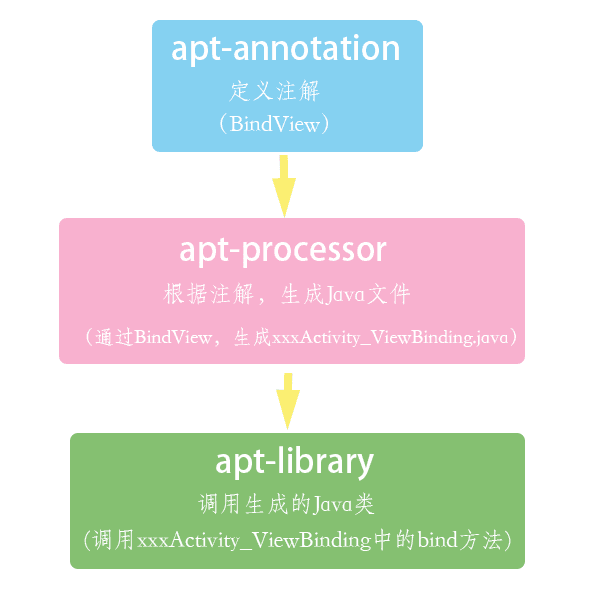

# [Android]APT

## 介绍

APT(Annotation Processing Tool)即注解处理器,是一种处理注解的工具,确切的说它是javac的一个工具,它用来在编译时扫描和处理注解.注解处理器以java代码(或者编译过的字节码)作为输入,生成.java文件作为输出.简单来说就是在编译期,通过注解生成.java文件.

## 作用

使用Apt的优点就是方便,简单,可以少写很多重复的代码

## 实现

### 目标

通过apt实现一个功能,通过对view变量的注解,实现view的绑定.类似ButterKnife中的@BindView

### 创建项目

- 创建library,apt-annotation

  自定义注解,存放@BindView

- 创建library,apt-processor,依赖apt-annotation

  注解处理器,根据annotation中的注解,在编译期生成xxxActivity_ViewBinding.java代码

- 创建library,apt-library,依赖apt-annotation,google-autoservice

  工具类,调用xxxActivity_ViewBinding.java中的方法,实现View的绑定



### apt-annotation(自定义注解)

创建注解类BindView

```java
@Retention(RetentionPolicy.CLASS)
@Target(ElementType.FIELD)
public @interface BindView{
    int value();
}
```

- @Retention(RetentionPolicy.CLASS):表示运行时注解
- @Target(ElementType.FIELD):表示注解范围为类成员

> @Retention:定义被保留的时间长短RetentionPolicy.SOURCE,RetentionPolicy.CLASS,RetentionPolicy.RUNTIME
>
> @Target:定义所修饰的对象范围TYPE,FIELD,METHOD,PARAMETTER,CONSTRUCTOR,LOCAL_VARIABLE

这里定义了运行时注解BindView,其中value()用于获取对应view的id.

### apt-processor(注解处理器)

在Module中添加依赖

```java
implementation 'com.google.auto.service:auto-service:1.0-rc2'
implementation project(':apt-annotation')
```

创建BindViewProcessor

