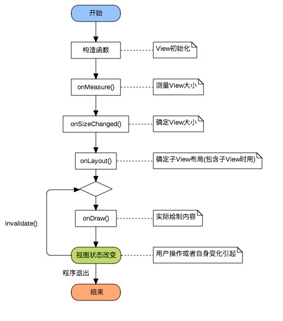

# 自定义View-分类与流程

http://www.gcssloop.com/customview/CustomViewProcess

自定义View绘制流程函数的调用链



## 自定义View的分类

- 自定义ViewGroup

  自定义ViewGroup一般是利用现有的组件根据特定的布局来组成新的组件,大多继承自ViewGroup或者各种Layout,包含有子View

- 自定义View

  在没有现成的View,需要自己实现的时候,就使用自定义View,一般继承自View,SurfaceView或者其他View,不包含子View


## 几个重要函数

### 构造函数

```java
public void AView(Context context){}
public void AView(Context context,AttributeSet attrs){}
public void AView(Context context,AttributeSet attrs,int defStyleAttr){}
public void AView(Context context,AttributeSet attrs,int defStyleAttr,int defStyleRes){}
```

详情如下

```java
//一般在直接new一个View的时候调用
public void AView(Context context){}

//一般在layout文件中使用的时候会调用,关于他的所有属性都会包含在attrs中传递进来
public void AView(Context context,AttributeSet attrs){}
```

以下方法会调用一个参数的构造函数

```java
AView v = new AView(this);
```

以下方法会调用两个参数的构造函数

```java
<com.zhoulesin.AView
	android:layout_width="wrap_content"
    android:layout_height="wrap_content"/>
```

### 测量View大小(onMeasure)

Q:为什么要测量View的大小

A:View的大小不仅由自身所决定,同时也会受到父控件的影响,为了我们的控件能更好的适应各种情况,一般会自己进行测量.

测量view大小使用的是onMeasure函数,我们可以从onMeasure的两个参数中取出宽高的相关数据:

```java
@Override
protected void onMeasure(int widthMeasureSpec,int heightMeasureSpec){
    int widthsize = MeasureSpec.getSize(widthMeasureSpec);	//取出宽度的确切数值
    int widthmode = MeasureSpec.getMode(widthMeasureSpec);	//取出宽度的测量模式
    
    int heightsize = MeasureSpec.getSize(heightMeasureSpec); //取出高度的确切数值
    int heightmode = MeasureSpec.getMode(heightMeasureSpec); //取出高度的测量模式
}
```

onMeasure函数中有widthMeasureSpec和heightMeasureSpec这两个int类型的参数,毫无疑问他们是和宽高相关的,但他们其实不是宽和高,而是由宽高和各自方向上对应的测量模式来合成的一个值.

测量模式一共有三种,被定义在Android中的View类的一个内部类,View.MeasureSpec中:

| 模式       | 二进制数值 | 描述                                                         |
| ---------- | ---------- | ------------------------------------------------------------ |
| UNSPECFIED | 00         | 默认值,父控件没有给子View任何限制,子view可以设置为任意大小   |
| EXACTLY    | 01         | 表示父控件已经确定的制定了子view的大小                       |
| AT_MOST    | 10         | 表示子view具体大小没有尺寸限制,但是存在上限,上限一般为父view大小 |

在int类型的32位二进制中,31-30这两位表示测量模式,29-0这30位表示宽和高的实际值,实际上如下

以1080为例

| 模式        | 模式数值 | 实际数值                         |
| ----------- | -------- | -------------------------------- |
| UNSPECIFIED | 00       | 00000000000000000000001111011000 |
| EXACTLY     | 01       | 01000000000000000000001111011000 |
| AT_MOST     | 10       | 10000000000000000000001111011000 |

注意:

​	如果对view的宽高进行修改了,不要调用super.onMeasure(),要调用setMeasuredDimension(widthsize,heightsize)这个函数

### 确定view大小(onsizechange)

这个函数在视图大小发生改变时调用

Q:在测量完view并使用setMeasureDimension函数之后view的大小基本上已经确定了,那么为什么还要再次确定view的大小呢

A:这是因为view 的大小不仅由view本身控制,而且受父控件的影响,所以我们在确定view大小的时候最好使用系统提供的onSizeChanged回调函数

```java
@Override
protected void onSizeChanged(int w,int h,int oldw,int oldh){
    super.onSizeChanged(w,h,oldw,oldh);
}
```

前面两个参数w,h就是view最终的大小

### 确定子view布局位置onlayout

确定布局的函数是onLayout,它用于确定子View的位置,在自定义ViewGroup中会用到,他调用的是子view的layout函数,

在自定义viewgroup中,onlayout一般是循环取出子view,然后经过计算得出各子view位置的坐标,然后用以下函数设置子view的位置

```java
child.layout(l,t,r,b);
```

四个参数分别

| 名称 | 说明                       | 对应的函数 |
| ---- | -------------------------- | ---------- |
| l    | view左侧距父view左侧的距离 | getLeft    |
| t    | view顶部距父view顶部的距离 | getTop     |
| r    | view右侧距父view左侧的距离 | getRight   |
| b    | view底部距父view顶部的距离 | getBottom  |

### 绘制onDraw

onDraw是实际绘制的部分,就是我们真正关心的部分,使用canvas绘图

```java
@Override
protected void onDraw(Canvas canvas){
    super.onDraw(canvas);
}
```

### 对外提供操作方法和监听回调

...

## 整理

- 自定义view分类

  | 类别      | 继承自             | 特点       |
  | --------- | ------------------ | ---------- |
  | view      | view surfaceView等 | 不含子view |
  | ViewGroup | ViewGroup,xxLayout | 包含子view |

- 自定义view流程

  | 步骤 | 关键字        | 作用                         |
  | ---- | ------------- | ---------------------------- |
  | 1    | 构造函数      | view初始化                   |
  | 2    | onMeasure     | 测量view大小                 |
  | 3    | onSizeChanged | 确定view大小                 |
  | 4    | onLayout      | 确定子view布局               |
  | 5    | onDraw        | 实际绘制内容                 |
  | 6    | 提供接口      | 控制view或监听view的某些状态 |

  


