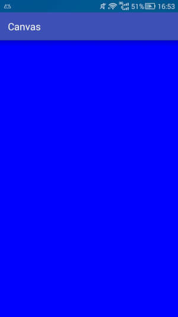
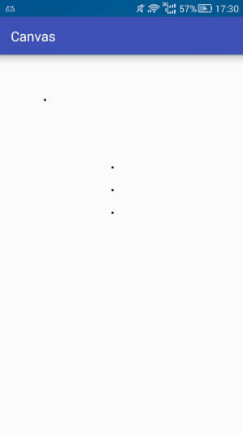
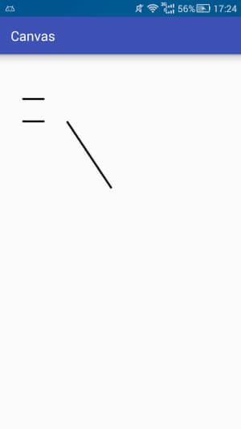
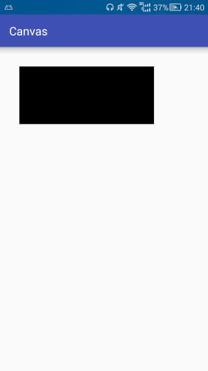
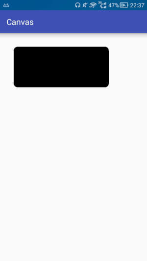
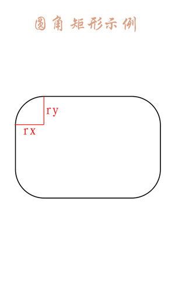
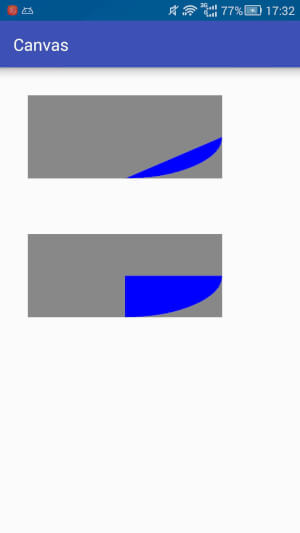
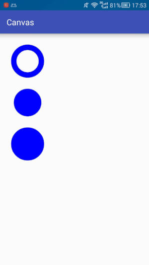
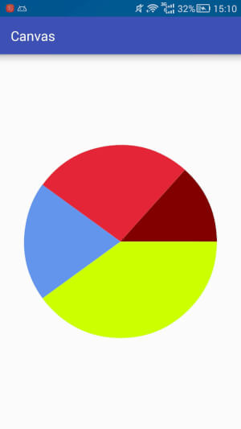

# Canvas之绘制图形

## Canvas简介

canvas我们可以称之为画布,能够在上面绘制各种东西,是安卓平台2d绘制的基础,非常强大.

- 可操作性强:由于这些东西是构成上层的基础,所以可操作性必然十分强大
- 比较难用:各种方法太过基础,想要完美的将这些操作组合起来有一定难度

## Canvas常用操作速查表

| 操作类型     | 相关API                                                      | 备注                                                         |
| ------------ | ------------------------------------------------------------ | ------------------------------------------------------------ |
| 绘制颜色     | drawColor,drawRGB,drawARGB                                   | 使用单一颜色填充整个画布                                     |
| 绘制基本形状 | drawPoint,drawPoints,drawLine,drawLines,<br />drawRect,drawRoundRect,drawOval,drawCircle,<br />drawArc | 依次为点,线,矩形,圆角矩形,椭圆,圆,圆弧                       |
| 绘制图片     | drawBitmap,drawPicture                                       | 绘制位图和图片                                               |
| 绘制文本     | drawText,drawPosText,drawTextOnPath                          | 依次为绘制文字,绘制文字时指定每个文字位置,根据路径绘制文字   |
| 绘制路径     | drawPath                                                     | 绘制路径,绘制贝塞尔曲线时也需要用到该函数                    |
| 顶点操作     | drawVertices,drawBitmapMesh                                  | 通过对顶点操作可以使图像变形,drawVertices直接对画布作用,drawBitmapMesh只对绘制的bitmap作用 |
| 画布剪裁     | clipPath,clipRect                                            | 设置画布的显示区域                                           |
| 画布快照     | save,restore,saveLayerXxx,restoreToCount,<br />getSaveCount  | 依次为保存当前状态,回滚到上一次保存的状态,保存图层状态,回滚到指定状态,获取保存次数 |
| 画布变换     | translate,scale,rotate,skew                                  | 依次为位移,缩放,旋转,错切                                    |
| Matrix矩阵   | getMatrix,setMatrix,concat                                   | 实际上画布的位移,缩放等操作都是图像矩阵Matrix,只不过Matrix比较难以理解和使用,故封装了一些常用的方法 |

## Canvas详解

## 绘制颜色

```java
canvas.drawColor(Color.BLUE);
```



### 创建画笔

```java
//1.创建画笔
private Paint mPaint = new Paint();

//2.初始化画笔
private void initPaint(){
    mPaint.setColor(Color.BLACK);
    mPaint.setStyle(Paint.Style.FILL);//填充模式
    mPaint.setStrokeWidth(10f);	//设置画笔宽度10
}

//3.在构造函数中使用
public AView(Context context,AttributeSet attrs){
    spuer(context,attrs);
    initPaint();
}
```

### 绘制点

```java
canvas.drawPoint(200,200,mPaint);	//一个点
canvas.drawPoints(new float[]{		//一组点,两个参数为一组
    500,500,
    500,600,
    500,700
},mPaint);
```



### 绘制直线

```java
canvas.drawLine(300,300,500,600,mPaint);	//(300,300) --> (500,600) 两个点的直线
canvas.drawLines(new float[]{				//一组线,四个参数为一组
    100,200,200,200,
    100,300,200,300
},mPaint);
```



### 绘制矩形

```java
//1,左上角,右下角两个点确定矩形
canvas.drawRect(100,100,800,400,mPaint);

//2.先封装矩形Rect
Rect rect = new Rect(100,100,800,400);
canvas.drawRect(rect,mPaint);

//3.先封装RectF
RectF rectf = new RectF(100,100,800,400);
canvas.drawRect(rectf,mPaint);
```



### 绘制圆角矩形

```java
//1.第一种
RectF rectf = new RectF(100,100,800,400);
canvas.drawRoundRect(rectf,30,30,mPaint);

//2.第二种
canvas.drawRoundRect(100,100,800,400,30,30,mPaint);
```



两个参数的含义(圆角矩形的圆角不是正圆,而是椭圆,所以需要rx和ry)



### 绘制椭圆

```java
RectF rectf = new RectF(100,100,800,400);
canvas.drawOval(rectF,mPaint);

canvas.drawOval(100,100,800,400,mPaint);
```

### 绘制圆

```java
canvas.drawCircle(500,500,400,mPaint);//圆心(x,y) ,半径(z)
```

### 绘制圆弧

```java
//第一种
public void drawArc(RectF oval,float startAngle,float sweepAngle,boolean useCenter,Paint paint){}

//第二种
public void drawArc(float left,float top,float right,float bottom,float startAngle,float sweepAngle,boolean useCenter,Paint paint){}
```

从上面可以看出,相比于绘制椭圆,绘制圆弧多了三个参数

```java
startAngle //开始角度
sweepAngle //扫过角度
useCenter  //使用中心点
```

```java
RectF rectf = new RectF(100,100,800,400);
mPaint.setColor(Color.GRAY);
canvas.drawRect(rectf,mPaint);

mPaint.setColor(Color.BLUE);
canvas.drawArc(rectf,0,90,false,mPaint);

//-------------------------------------

RectF rectf2 = new RectF(100,600,800,900);
mPaint.setColor(Color.GRAY);
canvas.drawRect(rectf2,mPaint);

mPaint.setColor(Color.RED);
canvas.drawArc(rectf2,0,90,true,mPaint);
```



## 简要介绍Paint

绘制的基本形状由Canvas确定,但绘制出来的颜色,具体效果由Paint确定

```java
mPaint.setStyle(Paint.Style.FILL); //设置画笔模式为填充
```

```java
STROKE	//描边
FILL	//填充
FILL_AND_STROKE //描边加填充
```

```java
Paint paint = new Paint();
paint.setColor(Color.BLUE);
paint.setStrokeWidth(40);

//描边
paint.setStyle(Paint.Style.STROKE);
canvas.drawCircle(200,200,100,paint);

//填充
paint.setStyle(Paint.Style.FILL);
canvas.drawCircle(200,500,100,paint);

//描边加填充
paint.setStyle(Paint.Style.FILL_AND_STROKE);
canvas.drawCircle(200,800,100,paint);

```



## 简要介绍画布操作

| 相关操作  | 简要介绍               |
| --------- | ---------------------- |
| save      | 保存当前画布状态       |
| restore   | 回滚到上一次保存的状态 |
| translate | 相对于当前位置位移     |
| rotate    | 旋转                   |

## 制作一个饼状图

###饼状图需要的基本数据

名字

数据值

百分比

角度

颜色

```java
public class PieData{
    private String name;
    private float value;
    private float percentage;
    
    private int color;
    private float angle;
    
    public PieData(String name,float value){
        this.name = name;
        this.value = value;
    }
}
```

### 自定义View

| 步骤 | 关键字        | 作用                                |
| ---- | ------------- | ----------------------------------- |
| 1    | 构造函数      | 初始化(paint等)                     |
| 2    | onMeasure     | 测量view 的大小(暂时不用关心)       |
| 3    | onSizeChanged | 确定view的大小(记录当前view 的宽高) |
| 4    | onLayout      | 确定子view布局(无)                  |
| 5    | onDraw        | 实际绘制内容(绘制饼状图)            |
| 6    | 提供接口      | 提供接口(提供设置数据的接口)        |

```java
public class PieView extends View{
    //颜色表
    private int[] colors = {0xffccff00,0xff6495ed,0xffe32636,0xff80000000,...};
    //饼状图初始绘制角度
    private float mStartAngle = 0;
    //数据
    private ArrayList<PieData> mData;
    //宽高
    private int mWidth,mHeight;
    //画笔
    private Paint mPaint = new Paint();

    public PieView(Context context){
        this(context,null);
    }
    
    public PieView(Context context,AttributeSet attrs){
        super(context,attrs);
        mPaint.setStyle(Paint.Style.FILL);
        mPaint.setAntiAlias(true);
    }
    
    @Override
    protected void onSizeChanged(int w,int h,int oldw,int oldh){
        super.onSizeChanged(w,h,oldw,oldh);
        mWidth = w;
        mHeight = h;
    }
    
    @Override
    protected void onDraw(Canvas canvas){
        super.onDraw(canvas);
        if(null == mData){
            return;
        }
        float currentStartAngle = mStartAngle;	//当前起始角度
        canvas.translate(mWidth/2,mHeight/2);	//将画布坐标原点移动到中心位置
        float r = (float)(Math.min(mWidth,mHeight)/2*0.8);	//饼状图半径
        RectF rect = new RectF(-r,-r,r,r);		//饼状图绘制区域
        
        for(int i=0;i<mData.size();i++){
            PieData pie = mData.get(i);
            mPaint.setColor(pie.getColor());
            canvas.drawArc(rect,currentStartAngle,pie.getAngle(),true,mPaint);
            currentStartAngle += pie.getAngle();
        }
    }
    
    //设置起始角度
    public void setStartAngle(int mStartAngle){
        this.mStartAngle = mStartAngle;
        invalidate();
    }
    
    public void setData(ArrayList<PieData> mData){
        this.mData = mData;
        initData(mData);
        invalidate();
    }

    private void initData(ArrayList<PieData> mData){
        if(null == mData || mData.size() == 0){
            return;
        }
        
        float sumValue = 0;
        for(int i=o;i<mData.size();i++){
            PieData pie = mData.get(i);    
            sumValue += pie.getValue();
            int j = i % mColors.length;
            pie.setColor(mColors[j]);
        }
        
        float sumAngle = 0;
        for(int i=0;i<mData.size();i++){
            PieData pie = mData.get(i);
            float percentage = pie.getValue()/sumValue;
            float angle = percentage * 360;
            pie.setPercentage(percentage);
            pie.setAngle(angle);
            sumAngle+=angle;
        }
        
    }

}
```

**PS:在更改了数据需要重绘界面时要调用invalidate这个函数**

