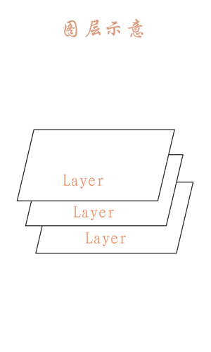

# Canvas之画布操作

Canvas的常用操作

| 操作类型     | 相关API                                                      | 备注                                                         |
| ------------ | ------------------------------------------------------------ | ------------------------------------------------------------ |
| 绘制颜色     | drawColor,drawRGB,drawARGB                                   | 使用单一颜色填充整个画布                                     |
| 绘制基本形状 | drawPoint,drawPoints,drawLine,drawLines<br />drawRect,drawRoundRect,drawOval,drawCircle<br />drawArc | 依次为点,线,矩形,圆角矩形,椭圆,圆,圆弧                       |
| 绘制图片     | drawBitmap,drawPicture                                       | 绘制位图和图片                                               |
| 绘制文本     | drawText,drawPosText,drawTextOnPath                          | 依次为绘制文字,绘制文字时指定每个文字位置,根据路径绘制文字   |
| 绘制路径     | drawPath                                                     | 绘制路径,绘制贝塞尔曲线时也需要用到                          |
| 顶点操作     | drawVertices,drawBitmapMesh                                  | 通过对顶点操作可以使图像形变,drawVertices直接对画布作用,drawBitmapMesh只对绘制的Bitmap作用 |
| 画布裁剪     | clipPath,clipRect                                            | 设置画布的显示区域                                           |
| 画布快照     | save,restore,saveLayerXxx,restoreToCount,<br />getSaveCount  | 依次为保存当前状态,回滚到上一次保存的状态,保存图层状态,回滚到指定状态,获取保存次数 |
| 画布变换     | translate,scale,rotate,skew                                  | 依次为位移,缩放,旋转,错切                                    |
| Matrix矩阵   | getMatrix,setMatrix,concat                                   | 实际上画布的位移,缩放等操作的都是图像矩阵Matrix,只不过Matrix比较难以理解和使用,故封装了一些常用的方法 |

## Canvas基本操作

### 画布操作

Q:为什么要有画布操作

A:画布操作可以帮助我们用更加容易理解的方式制作图形

例如:从坐标原点为起点,绘制一个长度为20dp,与水平线夹角为30度的线段 ??

1.按照我们通常的做法,先使用三角函数计算出线段结束点的坐标,然后调用drawLine即可..

2.假设我们先画一个长度为20dp的水平线,然后将这条水平线旋转30度,**那效果也是相同的**..

- 合理的使用画布操作可以帮助你用更容易理解的方式创作你想要的效果.
- 所有的画布操作都只影响后续的绘制,对之前已经绘制过的内容没有影响

### 位移translate

translate是坐标系的移动,可以为图形绘制选择一个合适的坐标系.

位移是基于当前位置移动,不是每次基于屏幕左上角(0,0)点移动,.

```java
//在坐标原点绘制一个黑色圆形
mPaint.setColor(Color.BLACK);
canvas.translate(200,200);
canvas.drawCircle(0,0,100,mPaint);

//在坐标原点绘制一个蓝色圆形
mPaint.setColor(Color.BLUE);
canvas.translate(200,200);
canvas.drawCircle(0,0,100,mPaint);
```


我们将坐标系移动一段距离绘制一个圆形,之后再移动一段距离绘制一个圆形,两次移动是可**叠加的**.

### 缩放scale

```java
public void scale(float sx,float sy);

public final void scale(float sx,float sy,float px,float py);
```

这两个方法中前两个参数是相同的分别为x轴和y轴的缩放比例.而第二种方法比前一种多了两个参数,用来控制缩放中心位置的.


缩放比例(sx,sy)取值范围详解:

| 取值范围(n) | 说明                                       |
| ----------- | ------------------------------------------ |
| (-∞,-1)     | 根据缩放中心放大n倍,再根据中心轴进行翻转   |
| -1          | 根据缩放中心轴进行翻转                     |
| (-1,0)      | 先根据缩放中心缩小到n,再根据中心轴进行翻转 |
| 0           | 不会显示,若sx为0,则宽度为0,不会显示,sy同理 |
| (0,1)       | 根据缩放中心缩小到n                        |
| 1           | 没有变化                                   |
| (1,∞)       | 根据缩放中心放大n倍                        |

- 缩放的中心默认为坐标原点,而缩放中心轴就是坐标轴

  ```java
  //坐标原点移动到中心
  canvas.translate(mWidth/2,mHeight/2);
  
  RectF rect = new RectF(0,-400,400,0);//矩形区域
  mPaint.setColor(Color.BLACK);
  canvas.drawRect(rect,mPaint);
  
  canvas.scale(0.5f.0.5f);	//画布缩放
  
  mPaint.setColor(Color.BLUE);
  canvas.drawRect(rect,mPaint);
  ```


- 第二种方法的调用

  ```java
  canvas.translate(mWidth/2,mHeight/2);
  
  RectF rect = new RectF(0,-400,400,0);
  mPaint.setColor(Color.BLACK);
  canvas.drawRect(rect,mPaint);
  
  canvas.scale(0.5f,0.5f,200,0);
  mPaint.setColor(Color.BLUE);
  canvas.drawRect(rect,mPaint);
  ```

  

- 当缩放比例为负数时,会根据缩放中心轴进行翻转

  ```java
  canvas.translate(mWidth/2,mHeight/2);
  RectF rect = new RectF(0,-400,400,0);
  mPaint.setColor(Color.BLACK);
  canvas.drawRect(rect,mPaint);
  
  canvas.scale(-0.5f,-0.5f);
  mPaint.setColor(Color.BLUE);
  canvas.drawRect(rect,mPaint);
  ```

  

- 第二种方法的负数的缩放

  ```java
  canvas.translate(mWidth/2,mHeight/2);
  RectF rect = new RectF(0,-400,400,0);
  mPaint.setColor(Color.BLACK);
  canvas.drawRect(rect,mPaint);
  canvas.scale(-0.5f,-0.5f);
  mPaint.setColor(Color.BLUE);
  canvas.drawRect(rect,mPaint);
  ```

  

- 和位移一样,缩放也是可以叠加的

  ```java
  canvas.scale(0.5f,0.5f);
  canvas.scale(0.3f,0.3f);
  ```

- 缩放小案例

  ```java
  canvas.translate(mWidth/2,mHeight/2);
  RectF rect = new RectF(-400,-400,400,400);
  for(int i=0;i<20;i++){
      canvas.scale(0.9f,0.9f);
      canvas.drawRect(rect,mPaint);
  }
  ```

  

### 旋转rotate

```java
public void rotate(float degress)
    
public final void rotate(float degress,float px,float py)
```

和缩放一样,第二种方法多出来的两个参数依旧是控制旋转中心点的

默认的旋转中心店依旧是坐标原点

```java
canvas.translate(mWidth/2,mHeight/2);

RectF rect = new RectF(0,-400,400,0);

mPaint.setColor(Color.BLACK);
canvas.drawRect(rect,mPaint);

canvas.rotate(180);

mPaint.setColor(Color.BLUE);
canvas.drawRect(rect,mPaint);
```


改变旋转中心位置

```java
canvas.translate(mWidth/2,mHeight/2);

RectF rect = new RectF(0,-400,400,0);
mPaint.setColor(Color.BLACK);
canvas.drawRect(rect,mPaint);

canvas.rotate(180,200,0);

mPaint.setColor(Color.BLUE);
canvas.drawRect(rect,mPaint);
```


旋转也是可以叠加的

```java
canvas.rotate(180);
canvas.rotate(20);
```

案例演示这个效果

```java
canvas.translate(mWidth/2,mHeight/2);

canvas.drawCircle(0,0,400,mPaint);
canvas.drawCircle(0,0,380,mPaint);

for(int i=0;i<=360;i+=10){
    canvas.drawLine(0,380,0,400,mPaint);
    canvas.rotate(10);
}
```


### 错切skew

skew错切是特殊类型的线性变换

```java
public void skew(float sx,float sy)
```

- sx:将画布在x方向上倾斜相应的角度,sx为倾斜角度的tan值
- sy:将画布在y方向上倾斜相应的角度,sy为倾斜角度的tan值

变换后

```java
x = x + sx*y
y = y + sy*x
```

```java
canvas.translate(mWidth/2,mHeight/2);
RectF rect = new RectF(0,0,200,200);

mPaint.setColor(Color.BLACK);
canvas.drawRect(rect,mPaint);
canvas.skew(1,0);

mPaint.setColor(Color.BLUE);
canvas.drawRect(rect,mPaint);
```


错切也是可叠加的,调用次序不同绘制结果也不同

```java
canvas.translate(mWidth/2,mHeight/2);
RectF rect = new RectF(0,0,200,200);

mPaint.setColor(Color.BLACK);
canvas.drawRect(rect,mPaint);

canvas.skew(1,0);
canvas.skew(0,1);

mPaint.setColor(Color.BLUE);
canvas.drawRect(rect,mPaint);
```


### 快照save和回滚restore

Q:为什么存在快照和回滚

A:画布的操作是不可逆的,而且很多画布操作会影响后续的步骤,例如第一个例子,两个圆形都是在坐标原点绘制的,而因为坐标系的移动绘制出来的实际位置不同.所以会对画布的一些状态进行保存和回滚.

相关API

| 相关API        | 简洁                                                        |
| -------------- | ----------------------------------------------------------- |
| save           | 把当前的画布的状态进行保存,然后放入特定的栈中               |
| saveLayerXxx   | 新建一个图层,并放入特定的栈中                               |
| restore        | 把栈中最顶层的状态取出来,并按照这个状态恢复当前的画布       |
| restoreToCount | 弹出指定位置及其以上所有的状态,并按照指定位置的状态进行恢复 |
| getSaveCount   | 获取栈中的内容的数量(即保存次数)                            |


Q:什么是画布和图层
A:实际上我们看到的画布是由多个图层构成的



实际上,我们之前讲解的绘制操作和画布操作都是在默认图层上进行的

在通常情况下,使用默认图层就可满足需求,但是如果需要绘制比较复杂的内容,如地图(地图可以有多个地图层叠加而成,),则分图层绘制比较好一些.

你可以吧这些图层看做是一层一层的玻璃板,你在每层的玻璃板上绘制内容,然后把这些玻璃板叠在一起看就是最终效果

- saveFlags

| 名称                       | 简介                                      |
| -------------------------- | ----------------------------------------- |
| ALL_SAVE_FLAG              | 默认,保存全部状态                         |
| CLIP_SAVE_FLAG             | 保存剪辑区                                |
| CLIP_TO_LAYER_SAVE_FLAG    | 剪裁区作为图层保存                        |
| FULL_COLOR_LAYER_SAVE_FLAG | 保存图层的全部色彩通道                    |
| HAS_ALPHA_LAYER_SAVE_FLAG  | 保存图层的alpha通道                       |
| MATRIX_SAVE_FLAG           | 保存matrix信息translate,rotate,scale,skew |

save有两种方法,

```java
public int save()
public int save(int saveFlags)
```

带有参数的方法可以只保存一部分状态,更加灵活.

每次调用save方法,都会在栈顶添加一条状态信息,

- saveLayerXxx

  ```java
  //无图层alpha(不透明度)通道
  public int saveLayer(RectF bounds,Paint paint){}
  public int saveLayer(RectF bounds,Paint paint,int saveFlags){}
  public int saveLayer(float left,float top,float right,float bottom,Paint paint){}
  public int saveLayer(float left,float top,float right,float bottom,Paint paint,int saveFlags){}
  
  //有图层alpha(不透明度)通道
  public int saveLayerAlpha(RectF bounds,int alpha){}
  public int saveLayerAlpha(RectF bounds,int alpha,int saveFlags){}
  public int saveLayerAlpha(float left,float top,float right,float bottom,int alpha){}
  public int saveLayerAlpha(float left,float top,float right,float bottom,int alpha,int saveFlags){}
  ```

  避免使用

- restore

  状态回滚

  就是从栈顶取出一个状态然后根据内容进行恢复

- restoreToCount

  弹出指定位置以及以上所有状态,并根据指定位置状态进行恢复

- getSaveCount

  获取保存的次数,注意;该函数的最小返回值是1

- 常用的具体方法

```java
save();	//保存状态
...		//具体操作
restore();//回滚到之前的状态

```

