# Canvas之图片文字

## Canvas的常用操作速查表

| 操作类型     | 相关API                                                      | 备注                                                         |
| ------------ | ------------------------------------------------------------ | ------------------------------------------------------------ |
| 绘制颜色     | drawColor,drawRGB,drawARGB                                   | 使用单一颜色填充整个画布                                     |
| 绘制基本形状 | drawPoint,drawPoints,drawLine,drawLines<br />,drawRect,drawRoundRect,drawOval<br />,drawCircle,drawArc | 依次为点,线,矩形,圆角矩形,椭圆,圆,圆弧                       |
| 绘制图片     | drawBitmap,drawPicture                                       | 绘制位图和图片                                               |
| 绘制文本     | drawText,drawPosText,drawTextOnPath                          | 依次为绘制文字,绘制文字时指定每个文字位置,根据路径绘制文字   |
| 绘制路径     | drawPath                                                     | 绘制路径,绘制贝塞尔曲线时也需要用到该函数                    |
| 顶点操作     | drawVertices,drawBitmapMesh                                  | 通过对顶点操作可以使图像形变,drawVertices直接对画布作用,drawBitmapMesh只对绘制的bitmap作用 |
| 画布剪裁     | clipPath,clipRect                                            | 设置画布的显示区域                                           |
| 画布快照     | save,restore,saveLayerXxx,restoreToCount,getSaveCount        | 依次为保存当前状态,回滚到上一次保存的状态,保存图层状态,回滚到指定状态,获取保存次数 |
| 画布变换     | translate,scale,rotate,skew                                  | 依次为位移,缩放,旋转,错切                                    |
| Matrix矩阵   | getMatrix,setMatrix,concat                                   | 实际上画布的位移缩放等操作都是图像矩阵Matrix,只不过Matrix比较难以理解和使用,故封装了一些常用的方法 |

## Canvas基本操作

### drawPicture

- 使用picture关闭硬件加速
- 使用picture关闭硬件加速
- 使用picture关闭硬件加速

在AndroidMenifest文件的application节点下添加android:hardwareAccelerated="false"

- Picture录制的是Canvas中绘制的内容

- 你可以把Picture看作是一个录制Canvas操作的录像机

picture的相关方法

| 相关方法                                                     | 简介                                                         |
| ------------------------------------------------------------ | ------------------------------------------------------------ |
| public int getWidth()                                        | 获取宽度                                                     |
| public int getHeight()                                       | 获取高度                                                     |
| public Canvas beginRecording(int width,int height)           | 开始录制(返回一个canvas,在canvas中所有的绘制<br />都会存储在picture中 |
| public void endRecording                                     | 结束录制                                                     |
| public void draw(canvas)                                     | 将picture中内容绘制到canvas中                                |
| public static picture createFromStream<br />(InputStream is) | 通过输入流创建一个picture(废弃)                              |
| public void writeToStream(OutputStream os)                   | 将picture中内容写出到输出流中(废弃)                          |

上面表格中基本已经列出列picture的所有方法,其中getWidth和getHeight没什么好说的

beginRecording和endRecording是成对使用的

```java
private Picture mPicture = new Picture();

private void recording(){
    Canvas canvas = mPicture.beginRecording(500,500);
    Paint paint = new Paint();
    paint.setColor(Color.BLUE);
    paint.setStyle(Paint.Style.FILL);
    
    canvas.translate(250,250);
    canvas.drawCircle(0,0,100,paint);
    
    mPicture.endRecording();
}

public AView(Context context,AttribuSet attrs)
{
    super(context,attrs);
    recording();
}


```

具体使用:

Picture虽然方法就那么几个,但是具体使用起来还是分很多种情况的,由于录制的内容不会直接显示,就像存储的视频不点击播放不会自动播放一样,同样,想要将picture中的内容显示出来就需要手动调用播放,绘制,将picture中的内容绘制出来可以有一下几种方法

| 序号 | 简介                                                         |
| ---- | ------------------------------------------------------------ |
| 1    | 使用picture提供的draw方法绘制                                |
| 2    | 使用canvas提供的drawpicture方法绘制                          |
| 3    | 将picture包装成为pictureDrawable,使用pictureDrawable的draw方法绘制 |

以上几种方法的主要区别:

| 主要区别           | 分类                          | 简介                                                  |
| ------------------ | ----------------------------- | ----------------------------------------------------- |
| 是否对canvas有影响 | 1有影响<br />2.3不影响        | 此处指绘制完成后是否会影响canvas的状态(Matrix,clip等) |
| 可操作性强弱       | 1可操作性弱<br />23可操作性强 | 此处的可操作性可以简单理解为对绘制结果可控程度        |

- 使用picture提供的draw方法绘制

  ```java
  mPicture.draw(canvas)
  ```

  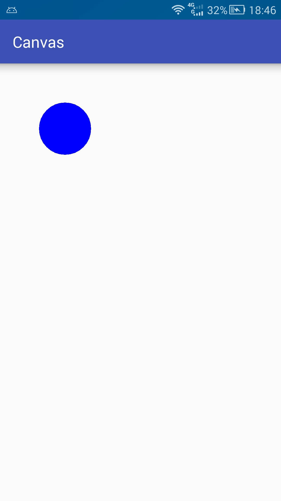

PS:这种方法在比较低版本的系统上绘制后可能会影响canvas状态,一般不使用

- 使用canvas提供的drawpicture方法绘制

  ```java
  public void drawPicture(Picture picture)
  public void drawPicture(Picture picture,Rect rect)
  public void drawPicture(Picture picture,RectF rect)
  ```

  和使用Picture的draw方法不同,canvas的drawPicture不会影响canvas状态 

  ```java
  canvas.drawPicture(mPicture,new RectF(0,0,mPicture.getWidth(),200));
  ```

  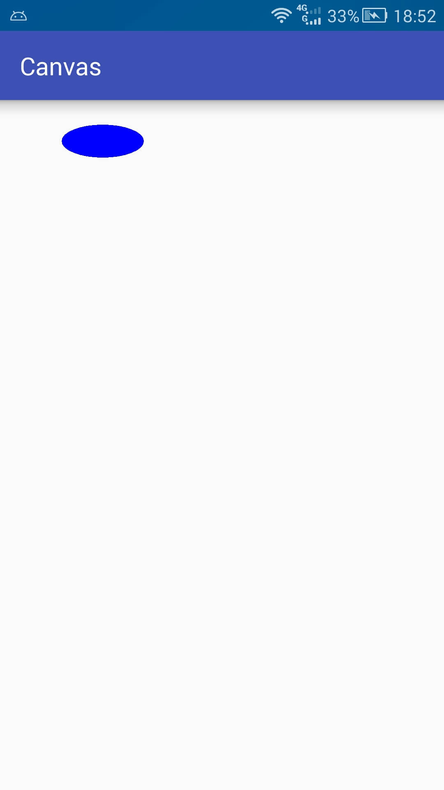

PS:对照上一张图片,可以比较明显的看出,绘制的内容根据选区进行了缩放

- 将picture封装成pictureDrawable,使用pictureDrawable的draw方法绘制

  ```java
  PictureDrawable drawable = new PictureDrawable(mPicture);
  //设置绘制区域,注意此处所绘制的实际内容不会缩放
  drawable.setBounds(0,0,250,mPicture.getHeight());
  
  drawable.draw(canvas);
  ```

  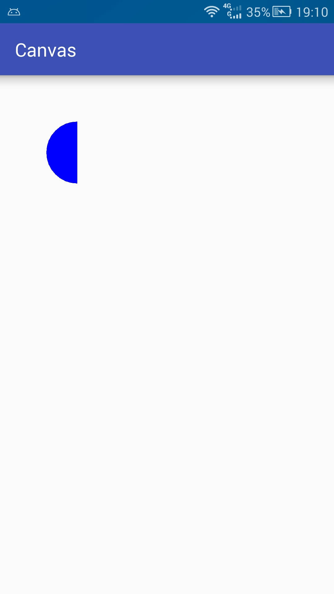

PS:此处setBounds是设置在画布上的绘制区域,并非根据该区域进行缩放,也不是裁剪Picture,每次都从Picture的左上角开始绘制

### drawBitmap

获取bitmap 的方式

| 序号 | 获取方式               | 备注                                                         |
| ---- | ---------------------- | ------------------------------------------------------------ |
| 1    | 通过bitmap创建         | 复制一个已有的bitmap或者创建一个空白的bitmap                 |
| 2    | 通过bitmapdrawable获取 | 从资源文件内存卡网络等地方获取一张图片并转换为内容不可变的bitmap |
| 3    | 通过bitmapfactory获取  | 从资源文件内存卡网络等地方获取一张图片并转换为内容不可变的bitmap |

通常来说,我们绘制bitmap都是读取已有的图片转换为bitmap绘制到canvas上

资源文件(drawable/mipmap/raw)

```java
Bitmap bitmap = BitmapFactory.decodeResource(mContext.getResources(),R.raw.bitmap);
```

资源文件(assets)

```java
Bitmap bitmapp = null;
try{
    InputStream is = mContext.getAssets().open("bitmap.png");
    bitmap = BitmapFactory.decodeStream(is);
    is.close();
}catch(IOException e){
    
}
```

内存卡文件

```java
Bitmap bitmap = BitmapFactory.decodeFile("/sdcard/bitmap.png");
```

网络文件

```java
Bitmap bitmap = BitmapFactory.decodeStream(is);
is.close()
```

- 绘制bitmap 

  ```java
  public void drawBitmap(Bitmap bitmap,Matrix matrix,Paint paint)
      
  public void drawBitmap(Bitmap bitmap,float left,float top,Paint paint)
  
  public void drawBitmap(Bitmap bitmap,Rect src,Rect dst,Paint paint)
  public void drawBitmap(Bitmap bitmap,Rect src,RectF dst,Paint paint)
  ```

  - 第一种方法中后两个参数是在绘制的时候对图片进行一些改变,如果只是需要将图片内容绘制出来只需要如下操作就可以了

  ```java
  canvas.drawBitmap(bitmap,new Matrix(),new Paint())
  ```

  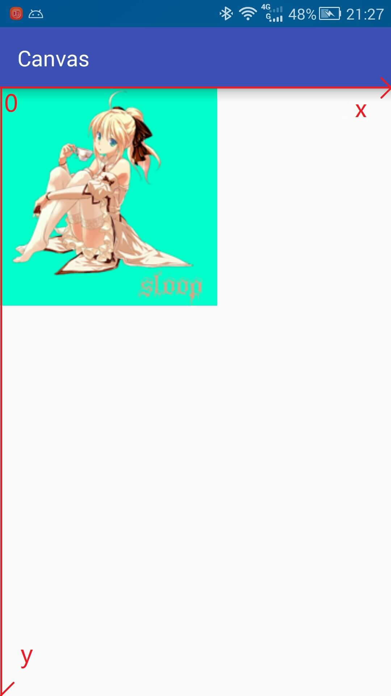
  - 第二种方法就是在绘制时指定了图片左上角的坐标

  ```java
  canvas.drawBitmap(bitmap,200,500,new Paint())
  ```

  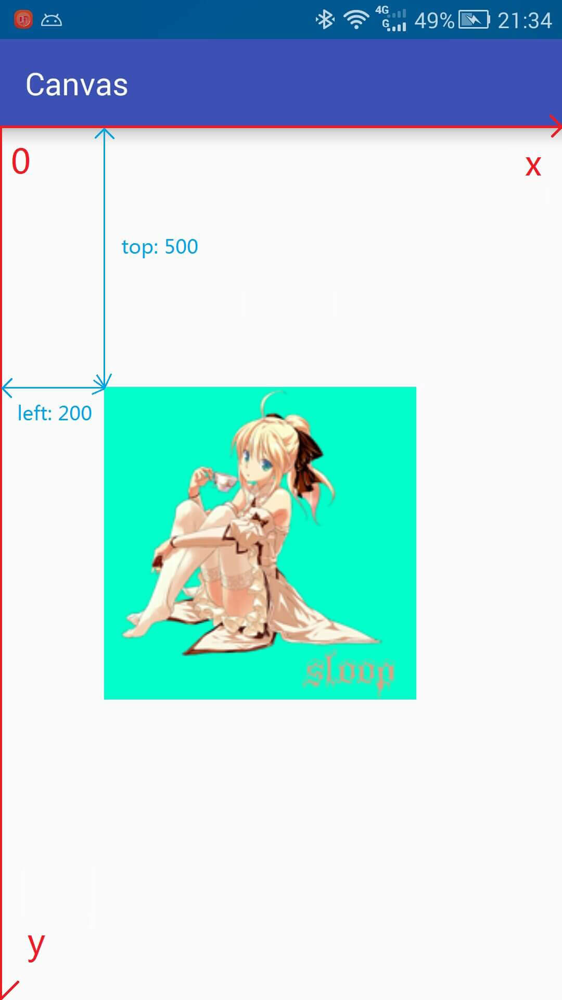
  - 第三种比较有意思

    | 名称     | 作用                       |
    | -------- | -------------------------- |
    | Rect src | 指定绘制图片的区域         |
    | rect dst | 指定图片在屏幕上显示的区域 |

  ```java
  //将画布坐标系移动到画布中央
  canvas.translate(mWidth/2,mHeight/2);
  
  //指定图片绘制区域(绘制图片的左上角1/4)
  Rect src = new Rect(0,0,bitmap.getWidth()/2,bitmap.getHeight/2);
  
  //指定图片在屏幕上的显示区域
  Rect dst = new Rect(0,0,200,400);
  
  canvas.drawBitmap(bitmap,src,dst,null);
  ```

  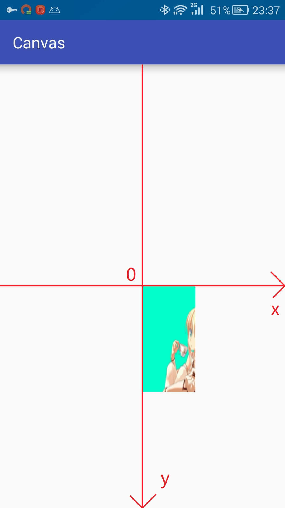

详解:

上面是以绘制该图为例,用src指定了图片绘制部分的区域,及下图中红色方框标注的区域

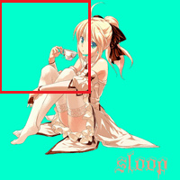

然后用dst指定了绘制在屏幕上的绘制,即下图中蓝色方框标注的区域,图片宽高会根据指定的区域自动进行缩放

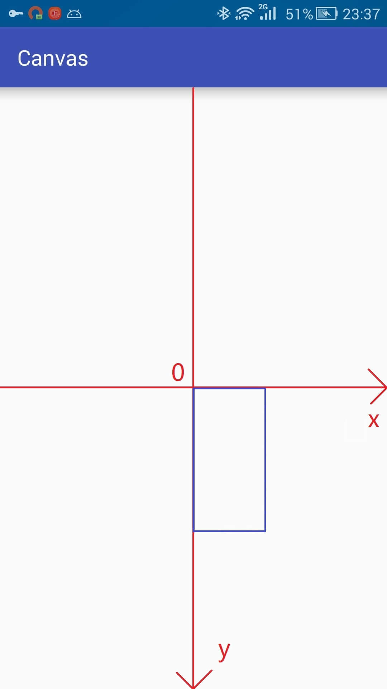

### drawText

```java
public void drawText(String text,float x,float y,Paint paint)
public void drawText(String text,int start,int end,float x,float y,Paint paint)
public void drawText(CharSequence text,int start,int end,float x, float y,Paint paint)
public void drawText(char[] text,int index,int count,float x,float y,Paint paint)
    
public void drawPosText(String text,float[] pos,Paint paint)
public void drawPosText(char[] text,int index,int count,float[] pos,Paint paint)

public void drawTextOnPath(String text,Path path,float hOffset,float vOffset,Paint paint)
public void drawTextOnPath(char[] text,int index,int count,Path path,float hOffset,float vOffset,Paint paint)
```

- 第一类只能指定文本基线位置(默认字符串左下)
- 第二类可以分别指定每个文字的位置
- 第三类是指定一个路径,根据路径绘制文字

Paint文本相关常用方法表

| 标题 | 相关方法                  | 备注                                          |
| ---- | ------------------------- | --------------------------------------------- |
| 色彩 | setColor,setARGB,setAlpha | 设置颜色,透明度                               |
| 大小 | setTextSize               | 设置文本字体大小                              |
| 字体 | setTypeface               | 设置或清除字体样式                            |
| 样式 | setStyle                  | 填充FILL,描边STROKE,填充加描边FILL_AND_STROKE |
| 对其 | setTextAlign              | 左对齐LEFT,居中对其CENTER,右对齐RIGHT         |
| 测量 | measureText               | 测量文本大小                                  |

我们先创建一个文本画笔

```java
Paint textPaint = new Paint();
textPaint.setColor(Color.BLACK);
textPaint.setStyle(Paint.Style.FILL);
textPaint.setTextSize(50);
```

- 第一类drawText

```java
String str = "ABCDEFG";
canvas.drawText(str,200,500,textPaint);
```

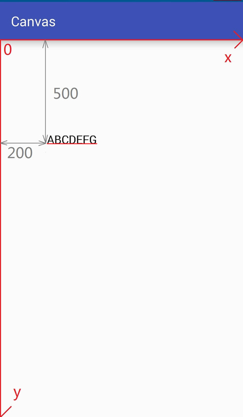

```java
String str = "ABCDEFG";
//1,3截取开始位置和结束位置 [1,3)
canvas.drawText(str,1,3,200,500,textPaint);
```

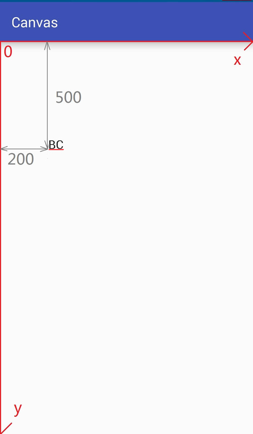

对于字符数组,char[]我们截取是使用起始位置和长度来确定

```java
char[] chars = "ABCDEFG".toCharArray();

canvas.drawText(chars,1,3,200,500,textPaint);
```

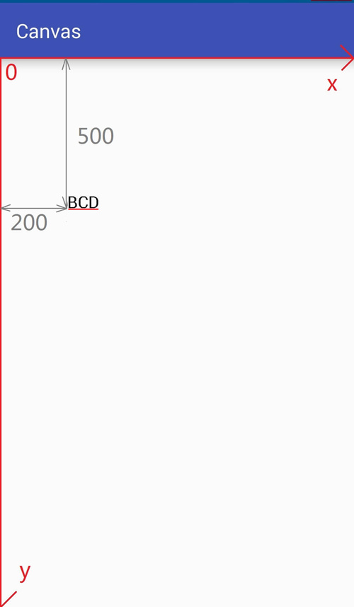

### drawPosText

这个方法中没有指定x,y坐标的参数,而是出现了float[] pos,这个pos的浮点型数组就是指定坐标的,给每个字符都指定一个位置...

```java
String str = "SLOOP";

canvas.drawPosText(str,new float[]{
    100,100,
    200,200,
    300,300,
    400,400,
    500,500
},textPaint);
```

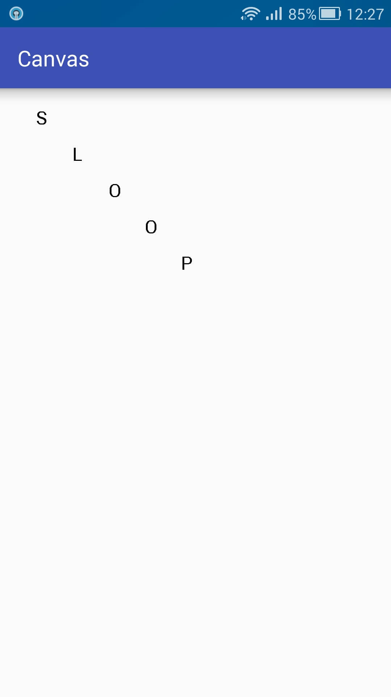

这个方法不推荐使用

| 序号 | 反对理由                                 |
| ---- | ---------------------------------------- |
| 1    | 必须指定所有字符位置,负责crash           |
| 2    | 性能不佳,在大量使用时候可能导致卡顿      |
| 3    | 不支持emoji特殊字符,不支持字形组合与分解 |

### drawTextOnPath

且听下回分解


