# Path基本操作

## Path常用方法表

| 作用       | 方法                                                         | 备注                                                         |
| ---------- | ------------------------------------------------------------ | ------------------------------------------------------------ |
| 移动起点   | moveTo                                                       | 移动下一次操作的起点位置                                     |
| 设置终点   | setLastPoint                                                 | 重置当前path中最后一个点的位置,如果在绘制之前调用,效果和moveTo相同 |
| 连接直线   | lineTo                                                       | 添加上一个点到当前点之间的直线到path                         |
| 闭合路径   | close                                                        | 连接第一个点和最后一个点,形成一个闭合区域                    |
| 添加内容   | addRect,addRoundRect,addOval,addCircle<br />addPath,addArc,arcTo | 添加(矩形,圆角矩形,椭圆,圆,路径,圆弧)到当前path              |
| 是否为空   | isEmpty                                                      | 判断path是否为空                                             |
| 是否为矩形 | isRect                                                       | 判断path是否是一个矩形                                       |
| 替换路径   | set                                                          | 用新的路径替换到当前路径所有的内容                           |
| 偏移路径   | offset                                                       | 对当前路径之前的操作进行偏移(不会影响之后的操作)             |
| 贝塞尔曲线 | quadTo,cubicTo                                               | 分别为二次和三次贝塞尔曲线的方法                             |
| rXxx方法   | rMoveTo,rLineTo,rQuadTo,rCubicTo                             | 不带r的方法是基于原点的坐标系,带r的方法是基于当前点坐标系    |
| 填充模式   | setFillType,getFillType,isInverseFillType,<br />toggleInverseFillType | 设置获取判断和切换填充模式                                   |
| 提示方法   | incReserve                                                   | 提示path还有多少个点等待加入,这个方法貌似会让path优化存储结构 |
| 布尔操作   | op                                                           | 对两个Path进行布尔运算,交集并集等                            |
| 计算边界   | computeBounds                                                | 计算path的边界                                               |
| 重置路径   | reset,rewind                                                 | 清除path中的内容,reset不保留内部数据接口,但会保留FillType,rewind会保留内部数据结构,不保留FillType |
| 矩阵操作   | transform                                                    | 矩阵变换                                                     |

## Path作用

Path在2d绘图中是一个很重要的东西

Path不仅能够绘制简单图形,也可以绘制一些比较复杂的图形,另外,根据路径绘制文本和裁剪画布都会用到path.

**path封装了有直线和曲线(二次,三次贝塞尔曲线)构成的几何路径.你能用canvas中的drawPath把这条路径画出来,同样支持paint的不同绘制模式.也可以用于裁剪画布和根据路径绘制文字.我们有时会用path来描述一个图像的轮廓,所以也会成为轮廓线**

路径有开放和封闭的区别

| 图像                                        | 名称     | 备注                       |
| ------------------------------------------- | -------- | -------------------------- |
| 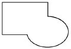 | 封闭路径 | 首尾相接形成了一个封闭区域 |
| 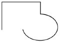 | 开放路径 | 没有首尾相接               |

## Path使用方法详解

### moveTo,setLastPoint,lineTo,close

先创建画笔

```java
Paint mPaint = new Paint();
mPaint.setColor(Color.BLACK);
mPaint.setStyle(Paint.Style.STROKE);
mPaint.setStrokeWidth(10);
```

### lineTo

```java
public void lineTo(float x,float y)
```

```java
canvas.translate(mWidth/2,mHeight/2);
Path path = new Path();
path.lineTo(200,200);
path.lineTo(200,0);
canvas.drawPath(path,mPaint);
```

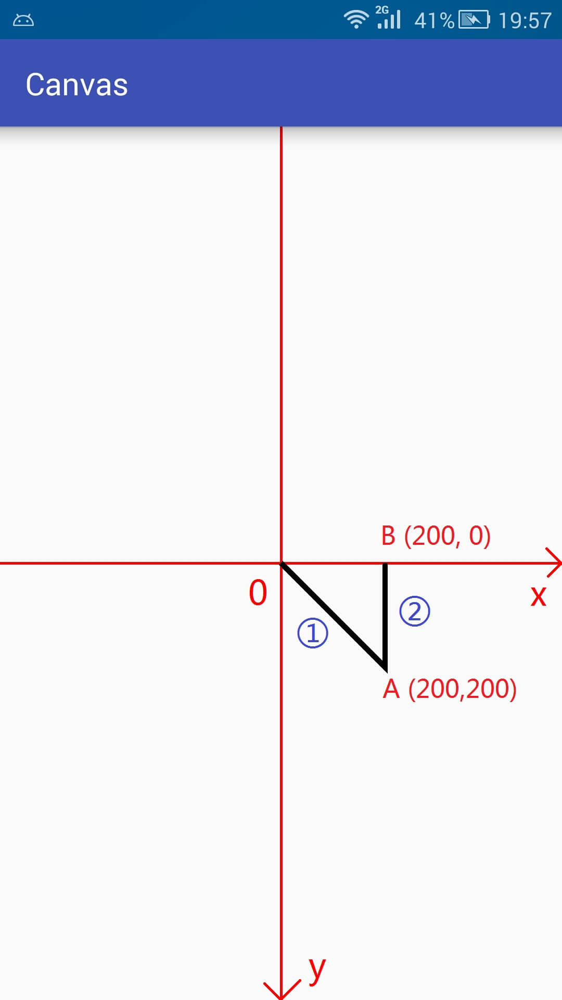

第一次由于之前没有操作,默认起点就是坐标原点,所以就是(0,0)到(200,200)的直线.

第二次的起点是上一次的终点,(200,200).所以就是(200,200)到(200,0)的直线

### moveTo和setLastPoint

```java
public void moveTo(float x,float y)
    
public void setLastPoint(float dx,float dy)
```

| 方法名       | 简介                           | 是否影响之前的操作 | 是否影响之后的操作 |
| ------------ | ------------------------------ | ------------------ | ------------------ |
| moveTo       | 移动下一次操作的起点位置       | 否                 | 是                 |
| setLastPoint | 设置之前操作的最后一个点的位置 | 是                 | 是                 |

```java
canvas.translate(mWidth/2,mHeight/2);
Path path = new Path();
path.lineTo(200,200);
path.moveTo(200,100);
path.lineTo(200,0);
canvas.drawPath(path,mPaint);
```

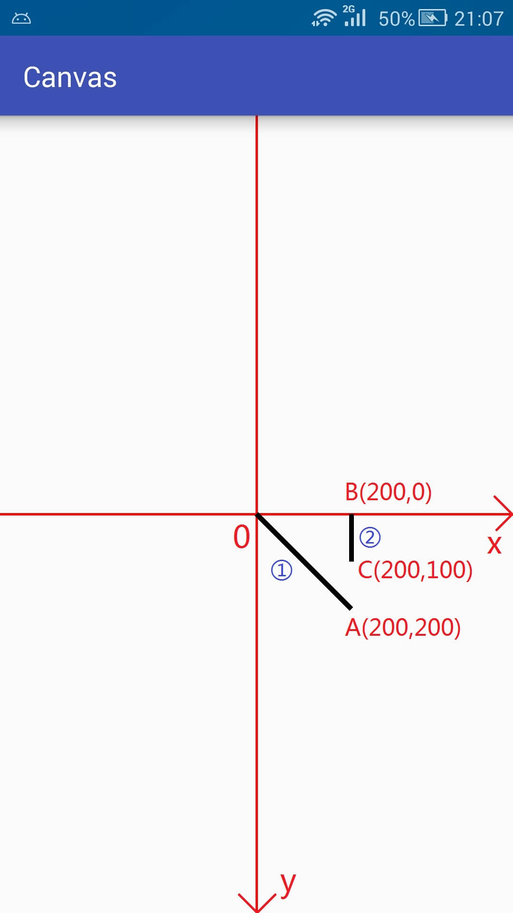

- moveTo只是改变下次操作的起点,在执行完第一次lineTo的时候,本来默认的点位置是200,200,但是moveTo将其改变成为了200,100,所以在第二次调用lineTo的时候就是连接200,100到200,0之间的直线了

```java
canvas.translate(mWidth/2,mHeight/2);
Path path = new Path();
path.lineTo(200,200);
path.setLastPoint(200,100);
path.lineTo(200,0);
canvas.drawPath(path,mPaint);
```

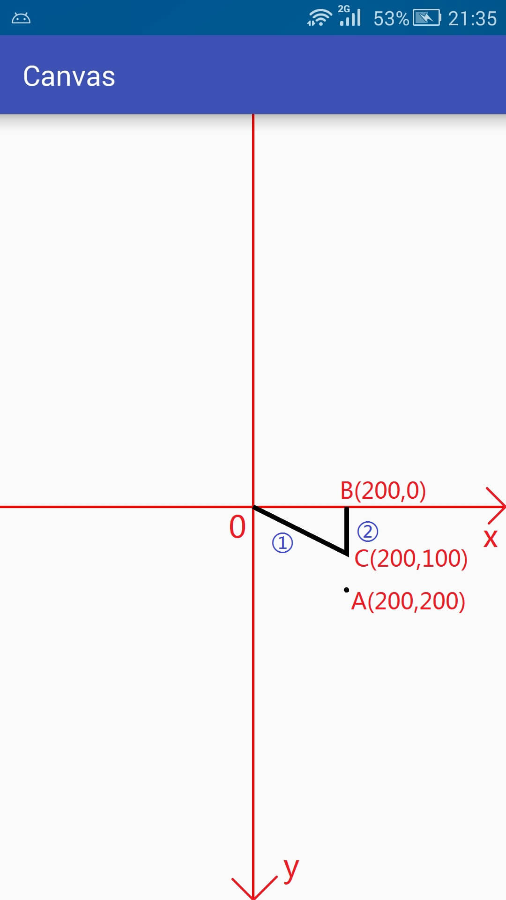

- setLastPoint是重置上一次操作的最后一个点,在执行完第一次的lineTo的时候,最后一个点事200,200,而setLastPoint更改最后一个点为200,100,所以在实际执行的时候,第一次lineTo就不是从原点到200,200的连线了,而变成了从原先到200,100的连线了
- 在执行完第一次lineTo和setlastpoint之后,最后一个点的位置是200,100,所以在第二次调用lineTo的时候就是200,100到200,0之间的连线

### close

```java
public void close()
```

close方法用于连接当前最后一个点和最初的一个点,最终形成一个封闭的图形

```java
canvas.translate(mWidth/2,mHeight/2);
Path path = new Path();
path.lineTo(200,200);
path.lineTo(200,0);
path.close();
canvas.drawPath(path,mPaint);
```

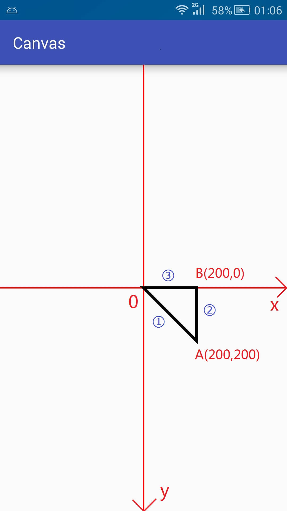

- close作用是封闭路径,与连接当前最后点和第一个点并不等价.如果连接最后一个点和第一个点仍然无法形成封闭图形,则close什么也不做

### addXxx与arcTo

在path中添加基本图形,终点区分addArc和arcTo

```java
public void addCircle(float x,float y,float radius,Path.Direction dir)
public void addOval(RectF oval,Path.Direction dir)
public void addRect(float left,float top,float right,float bottom,Path.Direction dir)
public void addRect(RectF rect,Path.Direction dir)
public void addRoundRect(RectF rect,float[] radii,Path.Direction dir)
public void addRoundRect(RectF rect,float rx,float ry,Path.Direction dir)
```

Direction

| 类型 | 解释              | 翻译   |
| ---- | ----------------- | ------ |
| CW   | clockwise         | 顺时针 |
| CCW  | counter-clockwise | 逆时针 |

顺时针和逆时针的作用

| 序号 | 作用                                             |
| ---- | ------------------------------------------------ |
| 1    | 在添加图形时确定闭合顺序(各个点的记录顺序)       |
| 2    | 对图形的渲染结果有影响(是判断图形渲染的重要条件) |

```java
canvas.translate(mWidth/2,mHeight/2);
Path path = new Path();
path.addRect(-200,-200,200,200,Path.Direction.CW);
canvas.drawPath(path,mPaint);
```

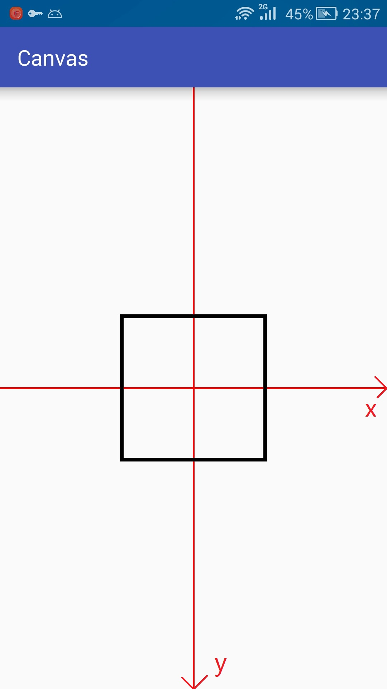


**将上面代码的CW改为CCW,两次显示的结果没有区别**

利用setLastPoint让他现出原形

```java
canvas.translate(mWidth/2,mHeight/2);
Path path = new Path();
path.addRect(-200,-200,200,200,Path.Direction.CW);
path.setLastPoint(-300,300);
canvas.drawPath(path,mPaint);
```

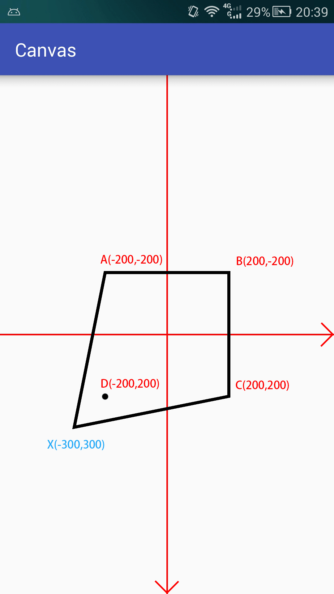

使用CCW,setLastPoint的显示

```java
canvas.translate(mWidth/2,mHeight/2);
Path path = new Path();
path.addRect(-200,-200,200,200,Path.Direction.CCW);
path.setLastPoint(-300,300);
canvas.drawPath(path,mPaint);
```

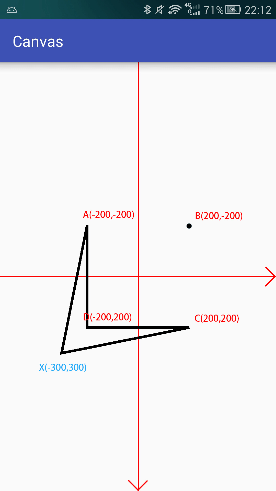

### addPath

```java
public void addPath(Path src)
public void addPath(Path src,float dx,float dy)
public void addPath(Path src,Matrix matrix)
```

第三个方法将src添加到当前path之前先使用Matrix进行变换

第二个方法比第一个方法多出来的两个参数是将src进行了位移之后再添加进当前path中

```java
canvas.trasnlate(mWidth/2,mHeight/2);
canvas.scale(1,-1);		//翻转y轴

Path path = new Path();
Path src = new Path();

path.addRect(-200,-200,200,200,Path.Direction.CW);
src.addCircle(0,0,100,Path.Direction.CW);

path.addPath(src,0,200);

mPaint.setColor(Color.BLACK);
canvas.drawPath(path,mPaint);
```

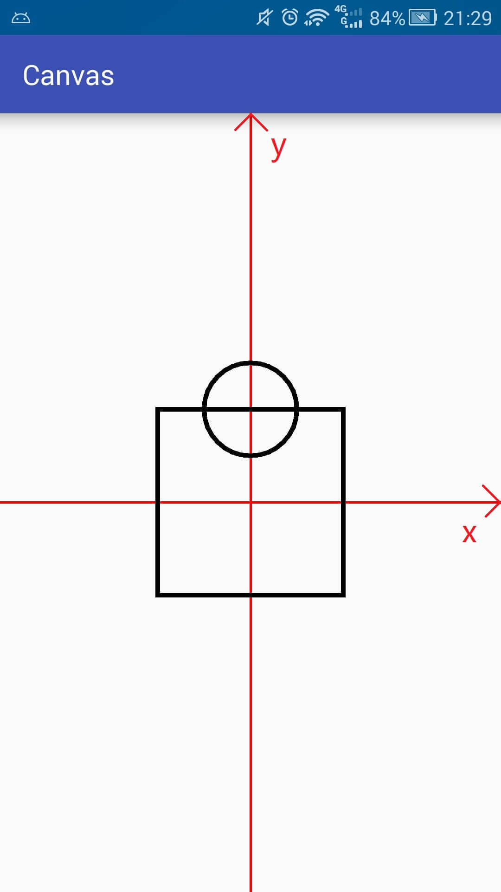

### addArc和arcTo

```java
public void addArc(RectF oval,float startAngle,float sweepAngle)
    
public void arcTo(RectF oval,float startAngle,float sweepAngle)
public void arcTo(RectF oval,float startAngle,float sweepAngle,boolean forceMoveTo)
```

参数表

| 参数        | 摘要                            |
| ----------- | ------------------------------- |
| oval        | 圆弧的外切矩形                  |
| startAngle  | 开始角度                        |
| sweepAngle  | 扫过角度 -360<= sweepAngle <360 |
| forceMoveTo | 是否强制使用moveTo              |

两个方法的区别

| 名称   | 作用           | 区别                                                         |
| ------ | -------------- | ------------------------------------------------------------ |
| addArc | 添加圆弧到path | 直接添加圆弧到path                                           |
| arcTo  | 添加圆弧到path | 添加圆弧到path,如果圆弧的起点和上次最后的一个坐标点不相同,就连接两个点 |

forceMoveTo的作用

| forceMoveTo | 含义                                                    | 等价方法                               |
| ----------- | ------------------------------------------------------- | -------------------------------------- |
| true        | 将最后一个点移动到圆弧起点,即不连接最后一个点与圆弧起点 | public void addArc                     |
| false       | 不移动,连接最后一个点与圆弧起点                         | public void arcTo(不带forceMoveTo参数) |

```java
canvas.translate(mWidth/2,mHeight/2);
canvas.scale(1,-1);

Path path = new Path();
path.lineTo(100,100);

RectF oval = new RectF(0,0,300,300);

path.addArc(oval,0,270);

canvas.drawPath(path,mPaint);
```

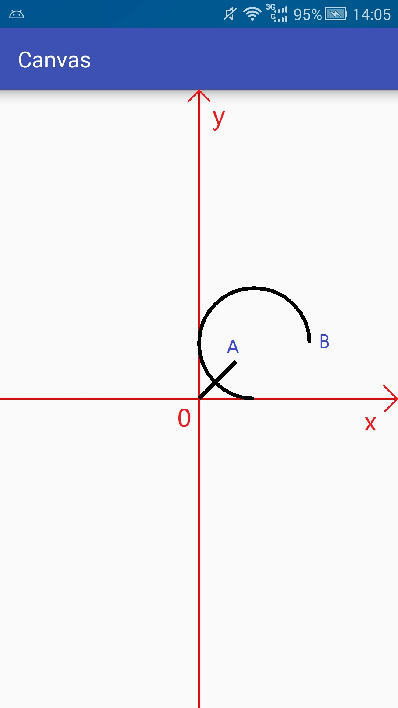

```java
canvas.translate(mWidth/2,mHeight/2);
canvas.scale(1,-1);

Path path = new Path();
path.lineTo(100,100);

RectF oval = new RectF(0,0,300,300);
path.arcTo(oval,0,270);

canvas.drawPath(path,mPaint);
```

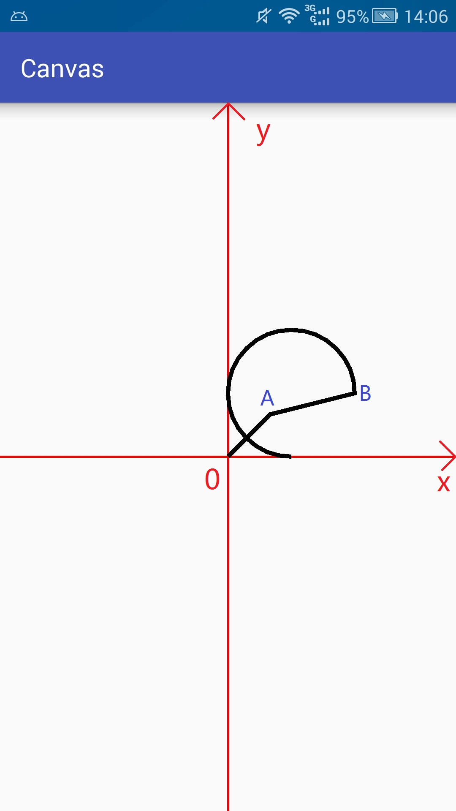

### isEmpty,isRect,isConvex,set,offset

### isEmpty

```java
public boolean isEmpty()
```

```java
Path path = new Path();
logd(path.isEmpty());

path.lineTo(100,100);
logd(path.idEmpty())
```

### isRect

```java
public boolean isRect(RectF rect)
```

判断是否是矩形,如果是矩形,会将矩形的信息放进参数rect中

```java
path.lineTo(0,400);
path.lineTo(400,400);
path.lineTo(400,0);
path.lineTo(0,0);

RectF rect = new RectF();
boolean b = path.isRect(rect);
logd(b +"," + rect.left +"," + rect.top)
```

### set

```java
public void set(Path src)
```

将新的path赋值到现有path

```java
canvas.translate(mWidth/2,mHeight/2);
canvas.scale(1,-1);

Path path = new Path();
path.addRect(-200,-200,200,200,Path.Direction.CW);

Path src = new Path();
src.addCircle(0,0,100,Path.Direction.CW);

path.set(src);

canvas.drawPath(path,mPaint);
```

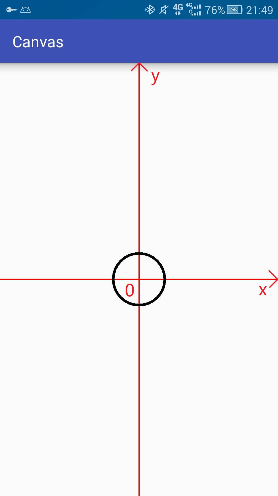

### offset

```java
public void offset(float dx,float dy)
public void offset(float dx,float dy,Path dst)
```

| dst     | 效果                                             |
| ------- | ------------------------------------------------ |
| null    | 将当前path平移后的状态存入dst中,不会影响当前path |
| notnull | 平移将作用于当前path,相当于第一种方法            |

```java
canvas.translate(mWidth/2,mHeight/2);
canvas.scale(1,-1);

Path path = new Path();
path.addCircle(0,0,100,Path.Direction.CW);

Path.dst = new Path();
dst.addRect(-200,-200,200,200,Path.Direction.CW);

path.offset(300,0,dst);

canvas.drawPath(path.mPaint);

mPaint.setColor(Color.BLUE);
canvas.drawPath(dst,mPaint);
```

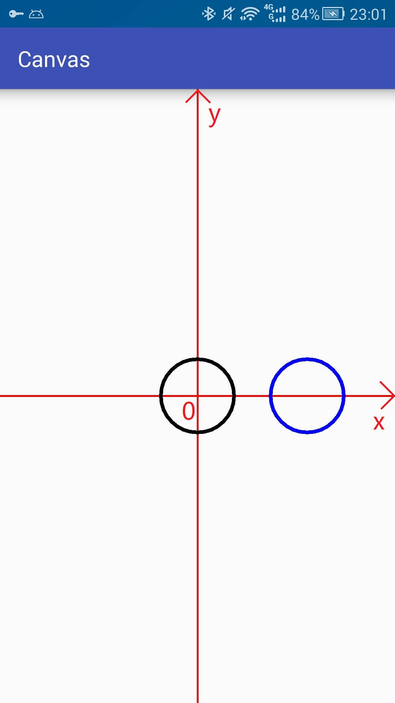


