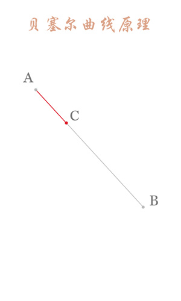
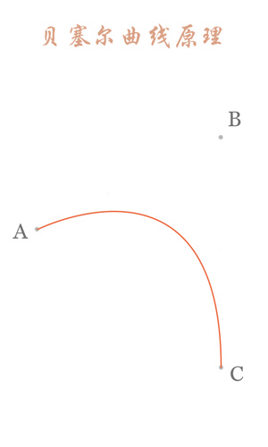
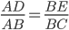
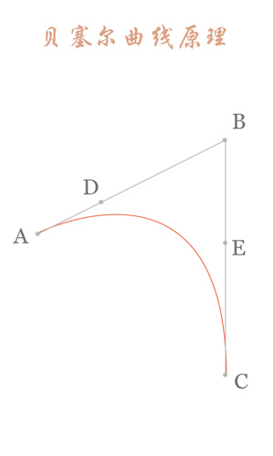
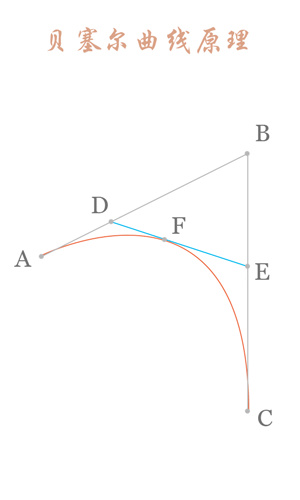
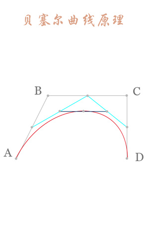
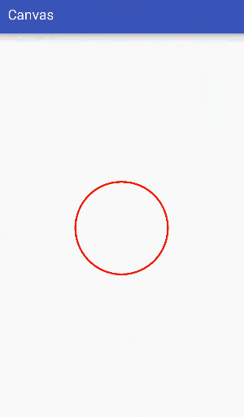
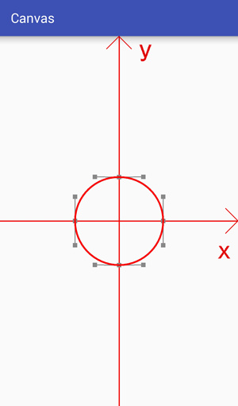
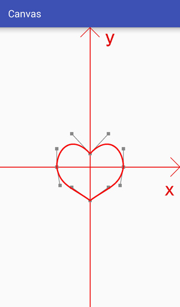
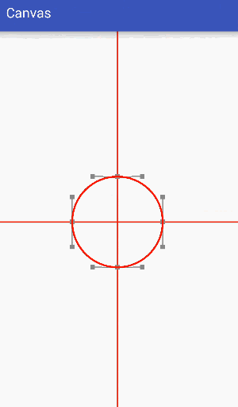

# Path之贝塞尔曲线

## Path常用方法表

| 作用       | 相关方法                                                     | 备注                                                         |
| ---------- | ------------------------------------------------------------ | ------------------------------------------------------------ |
| 移动起点   | moveTo                                                       | 移动下一次操作的起点                                         |
| 设置终点   | setLastPoint                                                 | 重置当前path中的最后一个点的位置,如果在绘制之前调用,效果和moveTo相同 |
| 连接直线   | lineTo                                                       | 添加上一点到当前点之间的直线到path                           |
| 闭合路径   | close                                                        | 连接第一个点连接到最后一个点,形成一个闭合区域                |
| 添加内容   | addRect,addRoundRect,addOval,addCircle addPath,addArc,arcTo | 添加矩形圆角矩形椭圆圆路径,圆弧,到当前Path                   |
| 是否为空   | isEmpty                                                      | 判断Path是否为空                                             |
| 是否为矩形 | isRect                                                       | 判断path是否是一个矩形                                       |
| 替换路径   | set                                                          | 用新的路径替换到当前路径所有内容                             |
| 偏移路径   | offset                                                       | 对当前路径之前的操作进行偏移不会影响之后的操作               |
| 贝塞尔曲线 | quadTo,cubicTo                                               | 二次三次贝塞尔曲线                                           |
| rXxx       | rMoveTo,rLineTo,...                                          | 基于当前点的坐标系偏移                                       |
| 填充模式   | setFillType,getFillType,isInverseFillType toggleInverseFillType | 设置,获取,判断和切换填充模式                                 |
| 提示方法   | incReserve                                                   | 提示Path还有多少个点等待加入,该方法会让Path优化存储结构      |
| 布尔操作   | op                                                           | 对两个path进行布尔运算                                       |
| 计算边界   | computeBounds                                                | 计算path边界                                                 |
| 重置路径   | reset,rewind                                                 | 清除path中的内容,reset不保留内部的数据结构,但会保留FillType,rewind会保留内部数据结构,不保留FillType |
| 矩阵操作   | transform                                                    | 矩阵变换                                                     |

## 贝塞尔曲线

### 贝塞尔曲线的原理

| 类型   | 作用                     |
| ------ | ------------------------ |
| 数据点 | 确定曲线的起始和结束位置 |
| 控制点 | 确定曲线的弯曲程度       |

### 一阶曲线(直线)

只有数据点,没有控制点

### 二阶曲线

两个数据点,一个控制点

- 原理:连接AB,BC,并在AB上取点D,BC上取点E,使其满足

- 连接DE,取点F,使得.png)

- 这样获取到的点F就是贝塞尔曲线上的一个点

  

### 三阶曲线

两个数据点,两个控制点

## 让一个圆变成心形

### 分析

- 圆可以由四段三阶贝塞尔曲线组合而成
- 心形也可以由四段三阶贝塞尔曲线组成

- 我们只需要调整数据点和控制点的位置即可

### 核心难点

- 如何得到数据点和控制点的位置

  关于使用绘制圆形的数据点和控制点,数据只需要拿来用就行了

  https://stackoverflow.com/questions/1734745/how-to-create-circle-with-b%C3%A9zier-curves

  对于心形的数据点和控制点,可以由圆形的部分数据点和控制点平移后得到

- 如何达到渐变效果

  渐变就是每次对数据点和控制点稍微一动一点,然后重绘界面,在短时间多次的调整数据点和控制点,使其逐渐接近目标值,通过不断的重绘界面达到一种渐变的效果

  

