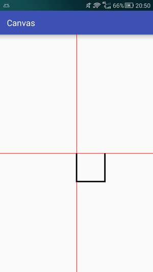

# PathMeasure

## Path & PathMeasure

PathMeasure是一个用来测量Path 的类

构造方法

| 方法名        | 释义                                    |
| ------------- | --------------------------------------- |
| PathMeasure() | 创建一个空的PathMeasure                 |
| PathMeasure() | 创建一个PathMeasure并关联一个指定的Path |

公共方法

| 返回值  | 方法名                                                       | 释义                               |
| ------- | ------------------------------------------------------------ | ---------------------------------- |
| void    | setPath(Path path,boolean forceClosed)                       | 关联一个Path                       |
| boolean | isClosed()                                                   | 是否闭合                           |
| float   | getLength()                                                  | 获取path的长度                     |
| boolean | nextCoutour()                                                | 跳转到下一个轮廓                   |
| boolean | getSegment(float startD,float stopD,Path dst,boolean startWithMoveTo) | 截取片段                           |
| boolean | getPosTan(float distance,float[] pos,float[] tan)            | 获取指定长度的位置坐标及该点切线值 |
| boolean | getMatrix(float distance,Matrix matrix,int flags)            | 获取指定长度的位置坐标及该点Matrix |

## 构造函数

### 无参构造

PathMeasure()

用这个构造函数可创建一个空的PathMeasure,但是使用之前需要调用setPath方法来与Path进行关联.被关联的Path必须是已经创建好的,如果关联之后Path内容进行了更改,则需要使用setPath方法重新关联.

### 有参构造函数

PathMeasure(Path path,boolean forceClosed)

用这个构造函数是创建一个PathMeasure并关联一个Path,其实和创建一个空的PathMeasure后调用setPath进行关联效果是一样的,同样,被关联的Path也必须是已经创建好的,如果关联之后Path内容进行了更改,则需要使用setPath方法重新关联.

该方法有两个参数,第一个参数自然就是被关联的Path了,第二个参数是用来确保Path闭合,如果设置为true,则不论之前Path是否闭合,都会自动闭合该Path(如果path可以闭合的话).

```txt
- 不论forceClosed设置为何种状态,都不会影响原有Path的状态,即Path与PathMeasure关联之后,之前的Path不会有任何改变
- forceClosed的设置状态可能会影响测量结果,如果Path未闭合但在与PathMeasure关联的时候设置forceClosed为true时,测量结果可能会比Path实际长度稍长一点,获取到的是该Path闭合时的状态.
```

```java
canvas.translate(mWidth/2,mHeight/2);

Path path = new Path();
path.lineTo(0,200);
path.lineTo(200,200);
path.lineTo(200,0);

PathMeasure measure1 = new PathMeasure(path,false);
PathMeasure measure2 = new PathMeasure(path,true);

logd("forceClosed=false:::" + measure1.getLength());	//600
logd("forceClosed=true:::" + measure1.getLength());		//800

canvas.drawPath(path,mPaint);
```



我们所创建的Path实际上是一个边长为200的正方形的三条边,通过上面的实例就能验证以上两个问题

- 我们将Path与两个的PathMeasure进行关联,并给forceClosed设置了不同的状态,之后绘制在绘制出来的Path没有任何变化,所以Path与PathMeasure进行关联并不会影响Path状态
- 我们可以看到,设置forceClosed为true的方法比设置为false的方法测量出来的长度要长一点,这是由于Path没有闭合的缘故,多出来的距离正是Path最后一个点与最开始一个点之间的距离.forceClosed为false测量的是当前Path状态的长度,forceClosed为true,则不论Path是否闭合都测量的是Path的闭合长度


## setPath,isClosed和getLength

- setPath是PathMeasure与Path关联的重要方法,效果和构造函数中两个参数的作用是一样的.


