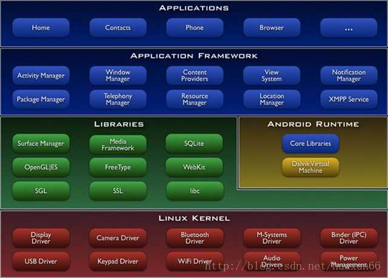

# Android系统架构

Android本质就是在标准的Linux系统上增加日历Java虚拟机Dalvik/ART,并在Dalvik/ART虚拟机上搭建了一个Java的application framework,所有的应用程序都是基于Java的application framework之上.

android分为四个层,从高层到低层分别是应用程序层,应用程序框架层,系统运行库层,Linux内核层.

- 应用程序层

  该层提供一些核心应用程序包,例如电子邮件,短信,日历,地图,浏览器和联系人管理等.同时,开发者可以利用Java语言编写属于自己的应用程序,而这些程序与那些核心应用程序彼此平等,友好共处

- 应用程序框架层

  应用框架层为开发者提供了可以开发应用程序所需要的API,我们平常开发应用程序都是调用的这一层所提供的API,当然也包括系统的应用.这一层的代码是由java编写,可以成为java framework.

  应用程序框架层包括活动管理器,位置管理器,包管理器,通知管理器,资源管理器,电话管理器,窗口管理器,内容提供者,视图系统和xmpp服务十个部分.

  | 名称                | 功能描述                                                     |
  | ------------------- | ------------------------------------------------------------ |
  | ActivityManager     | 管理各个应用程序生命周期以及通常的导航回退功能               |
  | LocationManager     | 提供地理位置以及定位功能服务                                 |
  | PackageManager      | 管理所有安装在Android系统中的应用程序                        |
  | NotificationManager | 使得应用程序可以在状态栏中显示自定义的提示信息               |
  | ResourceManager     | 提供应用程序使用的各种非代码资源,如本地化字符串,图片,布局文件,颜色文件等 |
  | TelephonyManager    | 管理所有的移动设备功能                                       |
  | WindowManager       | 管理所有开启的窗口程序                                       |
  | ContentProviders    | 使得不同的应用程序之间可以共享数据                           |
  | View System         | 构建应用程序的基本组件                                       |

- 系统运行库层

  系统运行库层分为两个部分,分别是C/C++程序库和Android运行时库

  (1)C/C++程序库

  C/C++程序库能被Android系统中的不同组件所使用,并通过应用程序框架为开发者服务..C/C++程序库包括九个子系统k,分别是图层管理,媒体库,SQlite,OpenGLEState,FreeType,WebKit,SGL,SSL和libc.

  | 名称            | 功能描述                                                     |
  | --------------- | ------------------------------------------------------------ |
  | OpenGLEs        | 3d绘图函数库                                                 |
  | libc            | 从BSD继承来得标准c系统函数库,专门为基于嵌入式Linux的设备定制 |
  | media framework | 多媒体库,支持多种常用的音频,视频格式录制和回放               |
  | sqlite          | 轻型的关系型数据库引擎                                       |
  | sgl             | 底层的2d图形渲染引擎                                         |
  | ssl             | 安全套接字,是为网络通信提供安全及数据完整性的一种安全协议    |
  | freetype        | 可移植的字体引擎,它提供统一的接口来访问多种字体格式文件      |

  (2)Android运行时库

  运行时库又分为核心库和ART`(5.0系统之后,Dalvik虚拟机被ART取代)`.核心库提供了Java语言核心库的大多数功能,这样开发者可以使用java语言来编写Android应用.相较于JVM,Dalvik虚拟机是专门为移动设备定制的,允许在优先的内存中同时运行多个虚拟机的实例,并且每个Dalvik应用作为一个独立的linux进程执行.独立的进程可以`防止在虚拟机崩溃的时候所有程序都被关闭`.而替代Dalvik虚拟机的ART的机制与Dalvik不同.在Dalvik下,应用每次运行的时候,字节码都需要通过即时编译器转换为机器码,这会拖慢应用的运行效率,而在ART环境中,应用在第一次安装的时候,字节码就会预先编译成机器码,使其成为真正的本地应用.

- Linux内核层

  Android的核心系统服务基于Linux内核,在此基础上添加了部分Android专用的驱动..系统的安全性,内存管理,进程管理,网络协议栈和驱动模型等都依赖于该内核..Linux内核也是作为硬件与软件栈的抽象层.

# Android系统源码

## 整体结构

Android 7.0的根目录结构说明如下表

|- Makefile	(全局Makefile文件,用来定义编译规则)

|- abi		(应用程序二进制接口)

|-art		(ART运行环境)

|-bionic		(bionic C库)

|-bootable	(启动引导相关代码)

|-build		(存放系统编译规则及generic等基础开发包配置)

|-cts		(Android兼容性测试套件标准)

|-dalvik		(dalvik Java虚拟机)

|-developers	(开发者目录)

|-development	(应用程序开发相关)

|-device		(设备相关配置)

|-docs		(参考文档目录)

|-external	(android使用的一些开源的模组)

|-frameworks	(核心框架--java及c++语言)

|-hardware	(部分厂家开源的硬件适配层HAL代码)

|-kernel		

|-libcore		(核心库相关文件)

|-libnativehelper	(动态库,实现JNI库的基础)

|-ndk		(NDK相关代码,帮助开发人员是应用程序中嵌入C/C++代码)

|-out		(编译完成后的代码输出与此目录)

|-packages	(应用程序包)

|-pdk		(Plug Development Kit 本地开发套件)

|-prebuilts	(x86和arm架构下预编译的一些资源)

|-sdk		(sdk及模拟器)

|-system	(底层文件系统库,应用及组件-----c语言)

|-tools		(工具文件)

|-toolchain	(工具链文件)

|-vendor	(厂商定制代码)

## 应用层部分

应用层位于整个Android系统的最上层,开发者开发的应用程序以及系统内置的应用程序都位于应用层.源码根目录中的packages目录对应着系统应用层

|-apps		(核心应用程序)

|-experimental	(第三方应用程序)

|-inputmethods	(输入法目录)

|-providers	(内容提供者目录)

|-screensavers	(屏幕保护)

|-services		(通信服务)

|-wallpapers		(墙纸)

从目录结构可以发现,packages目录存放着系统核心应用程序,第三方的应用程序和输入法等等,这些应用都是运行在系统应用层的,因此packages目录对应着系统的应用层.

## 应用框架层部分

应用框架层是系统的核心部分,一方面向上提供接口给应用层调用,另一方面向下与C/C++程序库以及硬件抽象层等进行衔接.应用框架层的主要实现代码在frameworks/base和frameworks/av目录下,其中frameworks/base目录结构如下

|-api	(定义api)

|-core	(核心库)

|-docs	(文档)

|-include	(头文件)

|-libs	(库)

|-media	(多媒体相关库)

|-nfc-extras	(nfc相关)

|-opengl 2d/3d (图形api)

|-sax	(xml解析器)

|-telephony	(电话通讯管理)

|-tests	(测试相关)

|-test_runner	(测试工具相关)

|-tools	(工具)

|-wifi	(wifi无线网络)

|-cmds	(重要命令,am,app_proce等)

|-data	(字体和声音等数据文件)

|-graphics	(图形图像相关)

|-keystore	(和数据签名证书相关)

|-location	(地理位置相关库)

|-native		(本地库)

|-obex		(蓝牙传输)

|-packages	(设置,TTS,VPN程序)

|-services	(系统服务)

