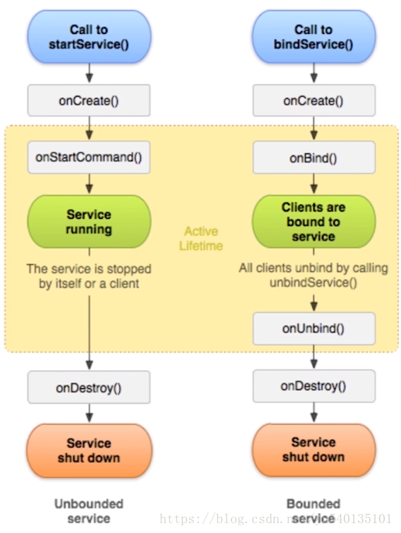

# Service和IntentService,Service和Activity之间通信

## Service

Android四大组件之一,Service是长期运行在后台的应用程序组件.

Service不是进程,也不是线程,它和应用程序在同一个进程中

Service不能做耗时操作,运行在主线程中

## Service应用场景

后台播放音乐,定位服务,每隔一定时间和服务器进行交互,等

### service两种启动方式和生命周期

- startService:

  service在系统中被启动多次,oncreate只会执行一次,onstartcommand方法调用次数和启动次数一致

- stopService

  调用stopService后,内部会执行onDestroy方法,如果一个service被绑定了,在没有解绑的前提下,调用stopService是无效的

- bindService

  绑定Service内部会调用oncreate, onbind

- unBindService

  解绑service,内部调用onUnbind,onDestroy

### 特殊情况,启动服务和解绑服务的结合体

使用startService启动一个后台服务,需要获取后台信息的时候,使activity绑定到该服务,不用的时候需要先解绑,

启动服务的优先级高于绑定服务

先启动服务后绑定服务,生命周期保持不变

先绑定服务后启动服务,生命周期变为启动服务

### Service和Activity之间的通信

Activity传递数据到Service使用Intent

Service传递数据到Activity用到BInder机制,不太好用(推荐EventBus)

### IntentService推荐使用

IntentService是继承与Service并处理异步请求的一个类

在IntentService内有一个工作线程来处理耗时操作

启动IntentService的方式和启动传统Service一样

同时,当任务执行完后,IntentService会自动停止,而不需要我们去手动控制

另外,可以启动IntentService多次,而每一个耗时操作会以工作队列的方式在IntentService的onHandleIntent回调方法中执行,并且,每次只会执行一个工作线程,执行完第一个再执行第二个.

所有的请求都在一个单线程中,不会阻塞应用程序的主线程(UI Thread)

同一时间只处理一个请求,那么,用IntentService有什么好处呢

- 我们省去了Service中手动开线程的麻烦
- 当操作完成时,我们不用手动停止Service