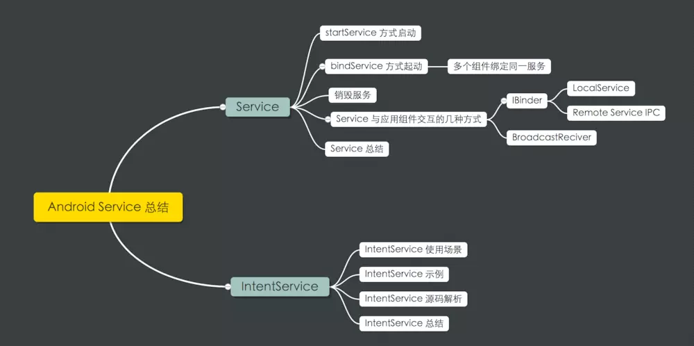

# Service,IntentService,Service和组件间通信



## Service

Service和Activity一样同为Android四大组件之一,并且他们都有各自的生命周期,

Service有两种启动方式,并且他们的生命周期是不一样的.

### startService启动

当应用组件通过startService方法来启动Service时,Service会处于启动状态,一旦服务启动,他就会在后台无限期的运行,生命周期独立于启动它的组件,即时启动它的组件已经销毁了也不受任何影响,由于启动的服务长期运行在后台,这会大量消耗手机的电量,因此,我们应该在任务执行完成之后调用stopself来停止服务,或者通过其他应用组件调用stopService来停止服务

startService启动服务后,会执行生命周期:onCreate--onStartCommand--onStart--onDestroy,

- onCreate:首次启动服务的时候,系统会调用这个方法,在onStartCommand和onBInd方法之前,如果服务已经启动起来了,再次启动时,则不会调用此方法,因此可以在oncreate方法中做一些初始化的操作,比如要执行耗时的操作,可以在这里创建线程,要播放音乐,可以在这里初始化音乐播放器
- onStartCommand:当通过startService方法来启动服务的时候,在onCreate方法之后就会回调这个方法,此方法调用服务后,服务就启动起来了,将会在后台无限期的运行,知道通过stopService或stopSelf方法来停止服务
- onDestroy:当服务不再使用且将被销毁时,系统将调用此方法.服务应该事先此方法来清理所有资源,如线程,注册的侦听器,接收器等..这是服务接收的最后一个调用

```txt
通过startService方式启动的服务,服务会无限期的在后台运行,直到通过stopService或stopSelf来终止服务.服务独立于启动它的组件,也就是说,当组件启动服务后,组件和服务就再也没有关系了,就算启动它的组件被销毁了,服务照样在后台运行.通过这种方式启动的服务不好与组件之间通信.
```

### bindService方式启动服务

除了startService来启动服务之外,另外一种启动服务的方式就是通过bindService方法了,也就是绑定服务,其实通过它的名字就很容易理解,绑定即 将启动组件和服务绑定在一起.前面讲的通过startService方式启动的服务是与组件相独立的,即使启动服务的的组件被销毁了,服务仍然在后台运行不受干扰.但是通过bindService方式绑定的服务就不一样了,它与绑定组件的生命周期是有关的.

**多个组件可以绑定到同一个服务上,如果只有一个组件绑定服务,当绑定的组件被销毁时,服务也就停止了,但是多个组件绑定到一个服务上,当绑定到该服务的所有的组件都被销毁时,服务才会停止**

bindServise绑定服务和startService的生命周期是不一样,bindService的生命周期

oncreate-onbind-onunbind-ondestroy

- onBind:当其他组件想通过bindService与服务绑定时,系统将会回调这个方法,在现实中,你必须返回一个IBinder接口,供客户端与服务进行通信,必须实现此方法,这个方法是Service的一个抽象方法,但是如果你不允许绑定的话,返回null就可以了
- onUnbind:当所有与服务绑定的组件都解除绑定时,就会调用此方法

使用

- 添加一个类继承Binder,在BInder类中添加其他组件要与服务交互的方法,并在onBind方法中返回IBinder实例对象

```java
public class SimpleService extends Service{
    public static final String TAG = "SimpleService";
    
    public IBinder onBind(Intent intent){
        return new MyBinder();
    }
    
    public boolean onUnbind(Intent intent){
        return super.onUnbind(intent);
    }
    
    onstart..
    oncreate..
    onstartCommand..
    ondestroy..
    
        public class MyBinder extends Binder{
            public String getStringInfo(){
                return "调用了服务中的方法";
            }
        }
    
}
```

- 绑定服务的时候,需要提供一个ServiceConnection接口,在接口回调中获取BInder对象,与服务进行通信

```java
public SimpleService.MyBinder binder;
private ServiceConnection conn = new ServiceConnection(){
    public void onServiceConnected(ComponentName name,IBinder service){
        //绑定成功后回调
        //1.获取binder接口对象
        binder = (cast)service;
        //2.从服务获取数据
        String content = binder.getStringInfo();
        //3.界面提示
        tv.setText(content);
    }
    
    public void onServiceDisconnected(ComponentName name){
        //解除绑定后回调
        binder = null;
    }
}
```

绑定服务的生命周期内依次调用了oncreate,onbind,onunbind,和ondestroy方法,只有中间两个生命周期方法和startservice启动服务是不同的.


```txt
service的生命周期方法不同于activity,不需要调用超类的生命周期方法
```

### 多个组件绑定同一个服务

Service是支持多个组件绑定在同一个服务上的,第一个组件绑定时会回调onCreate生命周期方法,后续的绑定只会调用onBInd方法,返回IBinder给客户端.当绑定在服务商的组件都调用了unbindService解除绑定服务或者组件本身就已经被系统回收,那么服务也就会被停止回收了,会回调onUnbind和onDestroy方法.

## Service与应用组件通信的几种方式

### BroadcastReceiver

startService方式启动的服务在后台,无限期地运行,并且与启动它的组件是独立的,启动Service之后也就与启动它的组件没有任何关系了.因此它是不能与启动它的组件之间相互通信的.虽然service没有提供这种启动方式的通信方法,我们还是可以通过其他方式来解决的,这就用到BroadcastReceiver

通过startService启动一个长期在后台运行的下载图片服务,然后在界面上点击下载按钮,然后在界面上点击下载按钮,通过intent传递一个下载链接给service,在下载完成后,通过broadcastReceiver通过activity界面显示图片;


