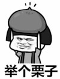

# MotionEvent详解

了解MotionEvent相关内容,简单介绍触摸事件,主要包括单点触控,多点触控,鼠标事件以及getAction()和getActionMasked()区别

| 版本号             | 更新内容                                         |
| ------------------ | ------------------------------------------------ |
| Android 1.0(API1)  | 支持单点触控和轨迹球的事件                       |
| Android 1.6(API4)  | 支持手势                                         |
| Android 2.0(API5)  | 支持多点触控                                     |
| Android 3.1(API12) | 支持触控笔,鼠标,键盘,操纵杆,游戏控制器等输入工具 |

MotionEvent负责集中处理所有类型设备的输入事件,但是由于某些设备使用的几率较小本文会忽略讲解,或者简要讲解,例如

- 轨迹球只出现在最早的设备上,现在的设备上已经见不到了
- 触控笔和手指处理流程基本相同
- 鼠标在手机上使用概率也比较小

## 单点触控

事件

| 事件           | 简介                       |
| -------------- | -------------------------- |
| ACTION_DOWN    | 手指`初次接触到屏幕`时触发 |
| ACTION_MOVE    | 手指`在屏幕上滑动`时触发   |
| ACTION_UP      | 手指`离开屏幕`时触发       |
| ACTION_CANCEL  | 事件`被上层拦截`时触发     |
| ACTION_OUTSIDE | 手指`不在控件区域`时触发   |

方法

| 方法      | 简介                          |
| --------- | ----------------------------- |
| getAction | 获取事件类型                  |
| getX      | 获得触摸点在当前View的X轴坐标 |
| getY      | 获得触摸点在当前view的y轴坐标 |
| getRawX   | 获得触摸点在整个屏幕的x轴坐标 |
| getRawY   | 获得触摸点在整个屏幕的y轴坐标 |

单点触控一次简单的交互流程是

ACTION_DOWN --> ACTION_MOVE --> ACTION_MOVE... -->ACTION_UP

针对单点触控的事件处理一般这样写:

```java
@Override
public boolean onTouchEvent(MotionEvent ev){
    switch(ev.getAction()){
        case MotionEvent.ACTION_DOWN:
            //手指按下
            break;
        case MotionEvent.ACTION_MOVE:
            //手指滑动
            break;
        case MotionEvent.ACTION_UP:
            //手指抬起
            break;
        case MotionEvent.ACTION_CANCEL:
            //事件被拦截
            break;
        case MotionEvent.ACTION_OUTSIDE:
            //超出区域
            break;
    }
    return super.onTouchEvent(ev);
}
```

## ACTION_CANCEL

ACTION_CANCEL的触发条件是被上层拦截,然而我们在前面说到,当事件被上层view拦截时,chlidView是收不到任何事件的,childview收不到事件,自然也就收不到ACTION_CANCEL了,所以说这个ACTION_CANCEL的正确触发条件并不是这样.

事实上,只有上层view回收事件处理权的时候,childview才会收到一个ACTION_CANCEL事件



```txt
例如:上层view是一个recyclerview,它收到一个ACTION_DOWN事件,由于这个可能是点击事件,所以它先传递给对应itemview,询问itemview是否需要这个事件,然而接下来又传递过来了一个ACTION_MOVE事件,且移动的方向和recyclerview的可滑动方向一致,所以recyclerview判断这个事件是滚动事件,于是要回收事件处理权,这时候对应的itemview会受到一个ACTION_CANCEL,并且不会再收到后续事件.

```

## ACTION_OUTSIDE

ACTION_OUTSIDE的触发条件更加奇葩,从字面上看,outside意思不就是超出区域么.?然而不论你如何滑动超出控件区域都不会触发ACTION_OUTSIDE这个事件

```txt
A movement has happened outside of the normal bounds of the UI element. This does not provide a full gesture, but only the initial location of the movement/touch.

一个触摸事件已经发生了UI元素的正常范围之外.因此不再提供完整的手势,只提供运动/触摸的初始位置.
```

我们知道,正常情况下,如果初始点击位置在该视图区域之外,该视图根本不可能会收到事件,然而,万事万物都不是绝对的,肯定还有一些特殊情况,你可曾还记得点击Dialog区域外关闭吗??

dialog就是一个特殊的视图(没有占满屏幕大小的窗口),能够接收到视图区域外的时间(虽然在通常情况下你根本用不到这个事件),除了dialog之外,你最可能看到这个事件的场景是悬浮框,当然,想要接收到视图之外的事件需要一些特殊的设置

```txt
设置视图的WindowManager布局参数的flags为FLAG_WATCH_OUTSIDE_TOUCH,这样点击事件发生在这个视图之外时,该视图就可以接收到一个ACTION_OUTSIDE事件
```

## 多点触控

出点触控,就是多个手指同时按在屏幕上,会产生很多的事件.

事件

| 事件                | 简介                                             |
| ------------------- | ------------------------------------------------ |
| ACTION_DOWN         | 第一个手指初次接触到屏幕时触发                   |
| ACTION_MOVE         | 手指在屏幕上滑动时触发,会多次                    |
| ACTION_UP           | 最后一个手指离开屏幕时触发                       |
| ACTION_POITNER_DOWN | 有非主要的手指按下(即按下之前已经有手指在屏幕上) |
| ACTION_POINTER_UP   | 有非主要的手指抬起(即抬起之后仍然有手指在屏幕上) |

方法

| 方法                               | 简介                                                         |
| ---------------------------------- | ------------------------------------------------------------ |
| getActionMasked                    | 与getAction类似,多点触控必须使用这个方法获取事件类型         |
| getActionIndex                     | 获取该事件是哪个指针产生的                                   |
| getPointerCount                    | 获取在屏幕上手指的个数                                       |
| getPointerId(int pointerIndex)     | 获取一个指针的唯一标识符id,在手指按下和抬起之间id始终不变    |
| findPointerIndex(int pointerIndex) | 通过pointerId获取到当前状态下PointIndex,之后通过pointIndex获取其他内容 |
| getX(int pointerIndex)             | 获取某一个指针的x坐标                                        |
| getY(int pointerIndex)             | 获取某一个指针的y坐标                                        |

## getAction和getActionMasked

当多个手指在屏幕上按下的时候,会产生大量的事件,如何在获取事件类型的同时区分这些事件就是一个大问题了.

ACTION_DOWN默认数值为0x00000000

ACTION_POINTER_DOWN默认数值为0x00000005

| 手指按下       | 触发事件(数值)                 |
| -------------- | ------------------------------ |
| 第一个手指按下 | ACTION_DOWN    0x00000000      |
| 第二个手指按下 | ACTION_POITNER_DOWN 0x00000105 |
| 第三个手指按下 | ACTION_POINTER_DOWN 0x00000205 |
| 第四个手指按下 | ACTION_POINTER_DOWN 0x00000305 |

注意:上面表格中的数值,可以看到随着按下手指数量的增加,这个数值也是一直变化的,进而导致我们使用getAction获取到的数值无法与标准的事件类型进行对比,为了解决这个问题,他们创建了一个getActionMasked方法,这个方法可以清除index数值,让其变成一个标准的事件类型

- 多点触控必须使用getActionMasked来获取事件类型

- 单点触控由于事件数值不变,使用getAction和getActionMasked两个方法都可以

- 使用getActionIndex可以获取到这个index数值.不过请鼠疫,getActionIndex只在down和up时有效,mvoe时是无效的

  目前来说获取事件类型使用getActionMasked就行了

  ```java
  final int action = event.getActionMasked();
  switch(action){
      //...
  }
  ```

## PointId

虽然前面说了一个acitonIndex,可以使用getActionIndex获得,但通过actionIndex字面意思知道,这个只表示事件的序号,而且,actionIndex只有在手指down和up时是有用的,在move是没有用的,事件追踪非常重要的一环就是move..

`追踪事件流,请认准PointId,`

PointId在手指按下时产生,手指抬起或者事件被取消后消失,是一个事件流程中唯一不变的标识,可以在手指按下时,通过getPointerId(int pointerIndex)获得(参数pointerIndex就是actionIndex)


