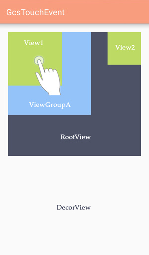
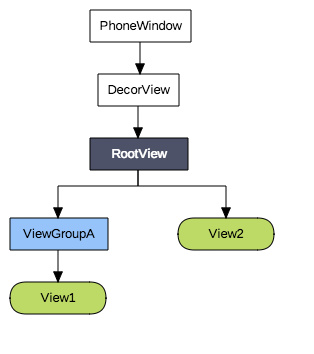
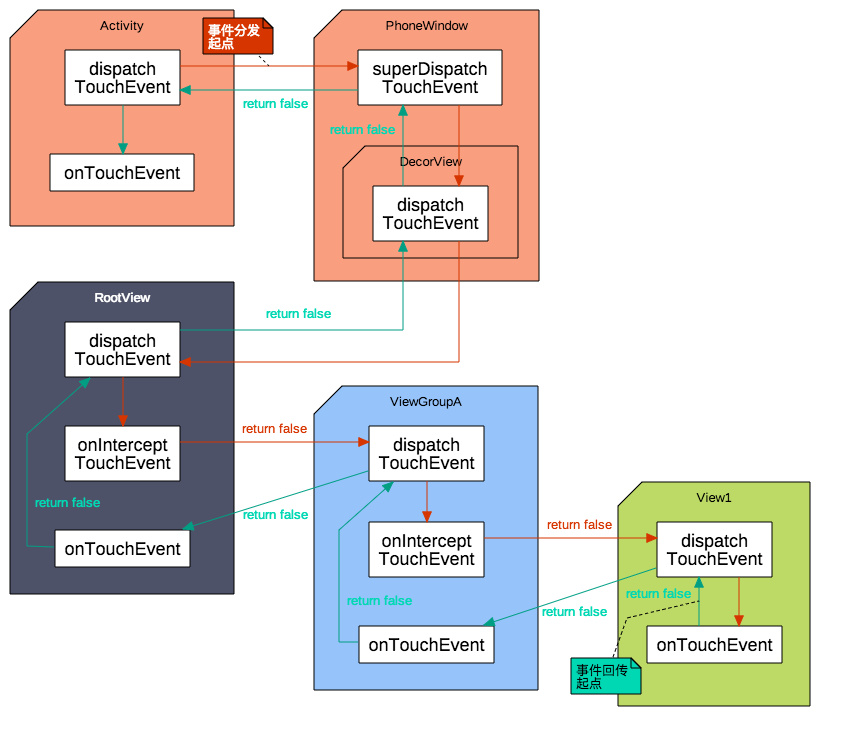
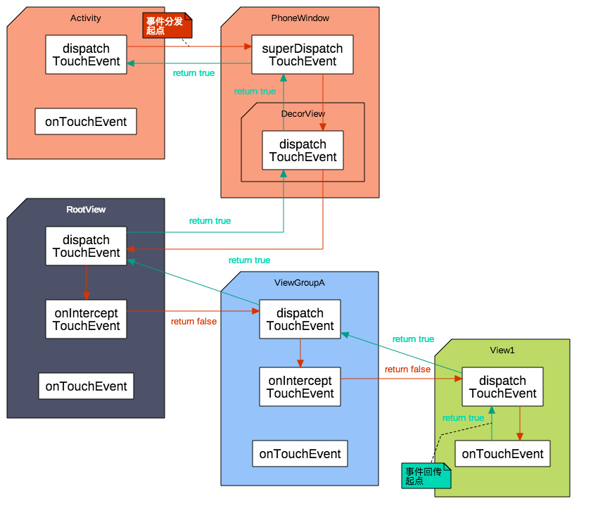
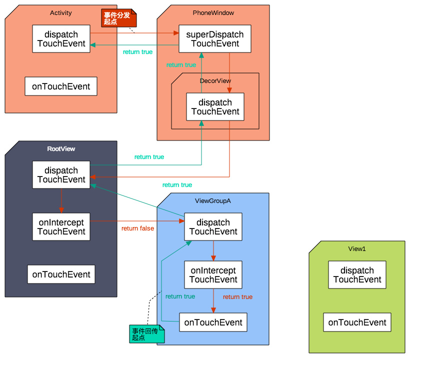

# 事件分发机制原理

## 为什么要有事件分发机制???

安卓上面的view是树形结构的,view可能会重叠在一起,当我们点击的地方有多个view都可以响应的时候,这个点击事件给谁呢?为了解决这一个问题,就有了事件分发机制

如下图,View是一层一层嵌套的,但手指点击`view1`的时候,下面的`ViewGroupA`,`RootView`等也是能够响应的,为了确定到底应该是哪个view处理这次点击事件,就需要事件分发机制来帮忙.



## View的结构

我们的View是树形结构的,在上一个问题中实例View的结构大致如下:

- layout文件:

```xml
<com...RootView
       android:layout_width="match_parent"
       android:layout_height="300dp">
        <com..ViewGroupA
              android:layout_width="200dp"
              android:layout_height="200dp">            
              <com...View1
                     android:layout_width="200dp"
                     android:layout_height="200dp">
               </com...View1>
    	</com..ViewGroupA>
    
     	<com...View2                     
               android:layout_width="80dp"
               android:layout_height="80dp"/>  
</com...RootView>
```

- View结构

  

  可以看到在上面的View结构中莫名多出来的两个东西,`phoneWindow`和`DecorView`,这两个我们并没有在layout文件中定义过,为什么存在呢

  `仔细观察上面的layout文件,你会发现一个问题,我在layout文件中的最顶层View(Group)的大小并不是填满父窗体的,留下了大量的空白区域,由于我们的手机屏幕不能透明,所以这些空白区域肯定要显示一些东西,那么应该显示什么呢`

  `有过安卓开发经验的都知道,屏幕上没有view遮挡的部分会显示主题的颜色.不仅如此,最上面的一个标题栏也没有在layout文件中,这个标题栏又是显示在哪里呢?`

 没错,这个主题颜色和标题栏等内容就是显示在DecorView中的.

- PhoneWindow

Window是一个抽象类,是所有视图的最顶层容器,视图的外观和行为都归他管,不论是背景显示,标题栏还是时间处理都是他管理的范畴,他其实就像是View界的太上皇,虽然能管的事情看似很多,但是没实权,因为抽象类不能直接使用

而phonewindow作为window唯一的实现类,phonewindow的权利非常大,不过对于我们来说用处并不大,

上面说的decorView是phoneWindow的一个内部类,就是跟在phonewindow身边专为phonewindow服务的,除了自己要干活之外,也负责消息的传递,phonewindow的指示通过decorView传递给下面的view,而下面的view信息也通过decorView回传给phoneWIndow.

## 事件分发,拦截,消费

下表省略了phonewindow和decorView

`√`表示有该方法

`×`表示没有该方法

| 类型     | 相关方法              | Activity | ViewGroup | View |
| -------- | --------------------- | -------- | --------- | ---- |
| 事件分发 | dispatchTouchEvent    | √        | √         | √    |
| 事件拦截 | onInterceptTouchEvent | ×        | √         | ×    |
| 事件消费 | onTouchEvent          | √        | √         | √    |

这三个方法均有一个boolean类型的返回值,通过返回true和false来控制事件传递的流程

PS:从表上可以看到Activity和View都是没有事件拦截的,这是因为:

- Activity作为原始的时间分发者,如果Activity拦截了事件会导致整个屏幕都无法响应时间,这肯定不是我们想要的效果
- View作为时间传递的最末端,要么消费掉事件,要么不处理进行回传,根本没必要进行事件的拦截

## 事件分发流程

前面我们了解到了我们的View是树形结构的,基于这样的结构,我们的事件可以进行有序的分发.

事件收集之后最先传递给Activity,然后依次向下传递,

```txt
Activity -> PhoneWindow -> DecorView -> ViewGroup -> ... -> View
```

这样的时间分发机制逻辑非常清晰,可是,如果最后分发到view,这个view也没有处理事件,怎么办??

如果没有任何view消费掉事件,那么这个事件会按照反方向回传,最终传回给Activity,如果最后Activity也没有处理,本次事件才会被抛弃

```txt
Activity <- PhoneWindow <- DecorView <- ViewGroup <- .. <- View
```

这是一个非常经典的责任链模式,如果自己能处理就拦截下来自己干,不能处理或者不确定就交给责任链中下一个对象.

这种设计是非常精巧的,上层View既可以直接拦截该事件,自己处理,也可以先询问(分发给)子View,如果子view需要就交给子view处理,如果子view不需要还能继续交给上层view处理,既保证了事件的有序性,又非常的灵活..

```txt
Activity -- 老板
RootView -- 经理
ViewGroupA -- 组长
View1	-- 码农
View2 	-- 垃圾
```

由于PhoneWindow和DecorView我们无法直接操作,以下示例省略PhoneWIndow和DecorView.

### 点击View1区域但没有任何View消费事件


当手指在`view1`区域点击了一下之后,如果所有View都不消耗事件,你就能看到一个完整的事件分发流程,大致如下:

`红色箭头方向表示时间分发方向`

`绿色箭头方向表示事件回传方向`



`注意:上图显示分发流程仅仅是一个示意流程,并不代表实际情况,如果按照实际情况绘制,会导致流程图非常复杂,`

- 事件返回时`dispatchTouchEvent`直接指向了父View的`onTouchEvent`是不合理的,实际上它仅仅是给了父View的`dispatchTouchEvent`一个false返回值,父View根据返回值来调用自身的`onTouchEvent`

- ViewGroup是根据`onInterceptTouchEvent`的返回值来确定是调用子View的`dispatchTouchEvent`还是自身的`onTouchEvent`,并没有将调用交给`onInterceptTouchEvent`.

- ViewGroup的事件分发机制伪代码如下:

  ```java
  public boolean dispatchTouchEvent(MotionEvent ev){
      boolean result = false;		//默认状态未没有消费过
      
      if(!onInterceptTouchEvent(ev)){	//如果没有拦截交给子View
          result = child.dispatchTouchEvent(ev);
      }
      
      if(!result){			//如果事件没有被消费,询问自身onTouchEvent
          result = onTouchEvent(ev);
      }
      
      return result;
  }
  ```

测试:

`情景:	老板:我看公司最近业务不咋地,准备发展一下电商业务,下周之前做个淘宝出来试试怎么样.`

`事件顺序:老板(Activity)要做淘宝,这个事件通过各个部门(ViewGroup)一层一层往下传,传到最底部,码农View1发现做不了,于是消息又一层一层回传到老板那里`

可以看到,整个事件传递路线非常有序,从activity开始,最后回传给activity结束,

```txt
MainActivity[老板]:dispatchTouchEvent 经理,我准备发展电商,下周做个淘宝出来
RootView[经理]:dispatchTouchEvent:呼叫技术部,老板要做淘宝,下周上线
RootView[经理]:onInterceptTouchEvent:(老板可能封了,但又不是我做)
ViewGroupA[组长]:dispatchTouchEvent:老板要做淘宝,下周上线
ViewGroupA[组长]:onInterceptTouchEvent:(看着不太靠谱,先问问小王)
View1[码农]:dispatchTouchEvent:做淘宝？？？？？？
View1[码农]:onTouchEvent:做不了做不了
ViewGroupA[组长]:onTouchEvent:小王说做不了
RootView[经理]:onTouchEvent:技术部说做不了
MainActivity[老板]:onTouchEvent:淘宝都做不了，还能干啥..
```

### 点击View1区域且事件被View1消费



测试：

情景：老板：我觉得咱们这个app按钮不好看，做的有光泽一点，要让人有一种想点的欲望

```txt
MainActivity[老板]:dispatchTouchEvent：把按钮做的有光泽一点，给人一种点击的欲望
RootView[经理]:dispatchTouchEvent:技术部,按钮家点光
RootView[经理]:onInterceptTouchEvent:我不会做
ViewGroupA[组长]:dispatchTouchEvent:小王，改按钮
ViewGroupA[组长]：onInterceptTouchEvent:小王做
View1[码农]:dispatchTouchEvent:加个光
View1[码农]:onTouchEvent:做好了
```

### 点击View1区域,事件被ViewGroupA拦截



测试

情景: 老板:报告一下项目进度

```txt
MainActivity[老板]: dispatchTouchEvent:项目做的怎么样了
RootView[经理]:dispatchTouchEvent:技术部,项目做完了吗
RootView[经理]:onInterceptTouchEvent:我不知道,问问组长
ViewGroupA[组长]:dispatchTouchEvent:项目进度
ViewGroupA[组长]:onInterceptTouchEvent:我知道
ViewGroupA[组长]:onTouchEvent:正在测试,明天就测试完了
```

### 其他情况

时间分发机制涉及到的情形非常多,记住以下几条原则:

- 如果事件被消费,就意味着事件信息传递终止
- 如果事件一直没有被消费,最后会传给Activity,如果Activit也不需要就被抛弃
- 判断事件是否被消费是根据返回值,而不是根据你是否使用了事件

## 总结

View的时间分发机制实际上就是一个非常经典的责任链模式,

`责任链模式`

`当有多个对象均可以处理同一个请求的时候,将这些对象串联成一条链,并沿着这条链传递改请求,直到有对象处理它为止`


