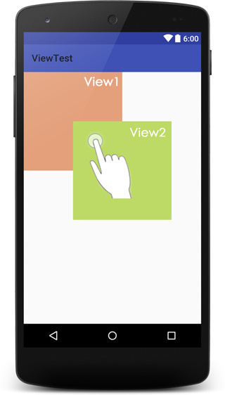

# 事件分发机制详解

正确理解在实际场景中事件分发机制的作用.

## 常见事件

既然是事件分发,总要有事件才能分发吧,了解一下常见的事件

根据面向对象思想,事件被封装成MotionEvent对象,

| 事件          | 简介                                |
| ------------- | ----------------------------------- |
| ACTION_DOWN   | 手指`初次接触到屏幕`时触发          |
| ACTION_MOVE   | 手指`在屏幕上滑动`时触发,会多次触发 |
| ACTION_UP     | 手指`离开屏幕`时触发                |
| ACTION_CANCEL | 事件`被上层拦截`时触发              |

对于单指触控来说,一次简单的交互流程是这样的:

手指落下ACTION_DOWN --> 移动ACTION_MOVE --> 离开ACTION_UP

- 本次示例中ACTION_MOVE有多次触发
- 如果仅仅是单击,不会触发ACTION_MOVE


## 事件分发,拦截与消费

| 类型     | 相关方法              | ViewGroup | View |
| -------- | --------------------- | --------- | ---- |
| 事件分发 | dispatchTouchEvent    | √         | √    |
| 事件拦截 | onInterceptTouchEvent | √         | ×    |
| 事件消费 | onTouchEvent          | √         | √    |

View相关

`dispatchTouchEvent`是事件分发机制中的核心,所有的事件调度都归他管.但是View也有dispatchTouchEvent方法....????\

- 我们知道View可以注册很多事件监听器,onClick,onLongClick,onTouch,,,并且View自身也有onTouchEvent方法,那么问题来了,这么多与事件相关的方法应该由谁来管理,

  dispatchTouchEvent,所以View也会有事件分发.

View有这么多监听器,到底哪个先执行????

与View事件相关的各个方法调用顺序是怎样的s

- 单击事件,onclicklistener,需要两个两个事件ACTION_DOWN和ACTION_UP才能触发,如果先分配给onClick判断,等他判断完,用户手指已经离开屏幕,造成view无法响应其他事件,应该最后调用
- 长按事件onlongclicklistener,也是需要长时间等待才能出结果,肯定不能排到前面,但因为不需要ACTION_UP.应该排在onclick前面
- 触摸事件,onTouchListener,如果用户注册了触摸事件,说明用户要自己处理触摸事件了,这个应排在最前面
- View自身处理,onTouchEvent,提供了一种默认的处理方式,如果用户已经处理好了,也就不需要了,所以应该排在onTouchListener后面

所以事件的调度顺序应该是`onTouchListener>onTouchEvent>onLongClickListener>onClickListener`


手指按下,不移动,稍等片刻抬起

```java
onTouchListener     ACTION_DOWN
onTouchEvent		ACTION_DOWN
onLongClickListener
onTouchListener		ACTION_UP
onTOuchListener		ACTION_UP
onCLickListener
```

因为长按onlongclicklistener不需要action_up,所以会在action_down之后就触发

看看源码

```java
public boolean dispatchTouchEvent(MotionEvent event){
    ...
    boolean result = false;		//result为返回值,主要作用是告诉调用者事件是否已经被消费
    if(onFilterTouchEventForSecurity(event)){
        ListenerInfo li = mListenerInfo;
        
        /**
         * 如果设置了onTouchListener,并且当前View可点击,就调用监听器的onTouch方法,如果onTouch方法返回值为true,就设置result为true
         */
        if(li != null && li.mOnTouchListener != null 
           &&(mViewFlags & ENABLED_MASK) == ENABLED
           && li.mOnTouchListener.onTouch(this,event)){
            result = true;
        }
        
        /**
         *	如果result为false,则调用自身的onTouchEvent,如果onTouchEvent
         *	返回值为true,则设置result为true
         */
        if(!result && onTouchEvent(event)){
            retult = true;
        }
    }
    ...
    return result;
}
```

伪代码,简单粗暴:

```java
public boolean dispatchTouchEvent(MotionEvent ev){
    if(mOnTouchListener.onTouch(this,ev)){
        return true;
    }
    if(onTouchEvent(event)){
        return true;
    }
    return false;
}
```

- OnClick和OnLongClick去哪里了???

  他们的具体调用在onTouchEvent中

  ```java
  public boolean onTouchEvent(MotionEvent ev){
      ...
      final int action = ev.getAction();
      //检查各种clickable
      if(((viewFlags & CLICKABLE) == CLICKABLE ||
         (viewFlags & LONG_CLICKABLE) == LONG_CLICKABLE) ||
         (viewFlags & CONTEXT_CLICKABLE) == CONTEXT_CLICKABLE){
          switch(action){
              case MotionEvent.ACTION_UP:
                  ...
                  removeLongPressCallback();	//移除长按
                  ...
                  performClick();			   //检查单击
                  ...
                  break;
              case MotionEvent.ACTION_DOWN:
                  ...
                  checkForLongClick(0)		//检测长按
                  ...
                  break;
              ...
          }
          return true;			//表示事件被消费
      }
      return false;
  }
  ```

### 注意:

- 上面代码中存在一个`return:true`;并且是只要View可点击就返回true,就表示事件被消费了
- 不论View自身是否注册点击事件,只要view是可点击的就会消费事件
- 事件是否被消费由返回值决定,true表示消费,false表示不消费,与是否使用了事件无关

## ViewGroup相关

viewgroup(通常是各种layout)的事件分发相对来说就要麻烦一些,因为viewgroup不仅要考虑自身,还要考虑各种childView,一旦处理不好就容易引起各种事件冲突

默认情况下viewgroup事件分发流程是这样的

- 判断自身是否需要(onInterceptTouchEvent是否拦截),如果需要,调用自己的onTouchEvent
- 自身不需要或者不确定,则询问childView,一般来说是调用手指触摸位置的childView
- 如果子childView不需要,则调用自身的onTouchEvent

伪代码

```java
public boolean dispatchTouchEvent(MotionEvent ev){
    boolean result = false; //状态默认为没有消费过
    
    if(!onInterceptTouchEvent(ev)){	//如果没有拦截交给子view
        result = child.dispatchTouchEvent(ev);	
    }
    
    if(!result){	//如果事件没有被消费,询问自身onTouchEvent
        result = onTouchEvent(ev);
    }
    
    return result;
}
```

上述代码是不完善的,还有很多问题没有解决

### ViewGroup中可能有多个ChildView,如何判断应该分配给哪一个

​	把所有的ChildView遍历一遍,如果手指触摸的点在childView区域内就分发给这个View

### 当该点的ChildView有重叠时应该如何分配

​	当childView重叠时,一般会分配给显示在最上面的childView

如何判断哪个view是显示在最上面呢,后面加载的一般会覆盖掉之前的,所以显示在最上面的是最后加载的.

如下

```java
<RelativeLayout xmlns:android="http://schemas.android.com/apk/res/android"
    xmlns:tools="http://schemas.android.com/tools"
    android:id="@+id/activity_main"
    android:layout_width="match_parent"
    android:layout_height="match_parent">
    <View
    	android:background="#E4A07B"
        android:layout_width="200dp"
        android:layout_height="200dp"/>
    <View
    	android:layout_margin="100dp"
        android:background="#BDDA66"
        android:layout_width="200dp"
        android:layout_height="200dp"/>
</RelativeLayout> 
```



当手指点击有重叠区域时,分如下几种情况

- 只有View1可点击时,事件将分配给View1,即时被View2遮挡,这一部分仍是View1的可点击区域
- 只有View2可点击时,事件将会分配给View2
- View1和View2均可点击时,事件会分配给后加载的View2,View2将事件消费掉,View1接收不到事件.

PS:

- 上面说的可点击,可点击包括很多情况,只要你给View注册了onClickListener,onLongClickListener,onContextClickListener其中的任何一个监听器或者设置了android:clickable="true"就代表这个View是可点击的.另外,某些view默认就是可点击的,如button,checkbox等
- 给View注册onTouchListener不会影响View的可点击状态.即时给View注册onTouchListener,只要不返回true就不会消费事件

### ViewGroup和childView同时注册了事件监听器onClik等,哪个会执行

事件优先给childView,会被childView消费掉,ViewGroup不会响应

### 所有事件都应该被同一View消费

在上面的例子中,我们分析后可以了解到,同一次点击事件只能被一个View消费,主要是为了防止事件响应混乱,如果再一次完整的时间中分别将不同的事件分配给了不同的view容易造成事件响应混乱

PS:View中onCLick事件需要同时接收到ACTION_DOWN和ACTION_UP才能触发,如果分配给了不同的view,那么onClick将无法被正确触发

安卓为了保证所有的事件都是被一个view消费的,对第一次事件ACTION_DOWN进行了判断,view只有消费了ACTION_DOWN事件,才能接收到后续的事件(可点击空间会默认消费所有事件),并且会将后续所有事件传递过来,不会在传递给其他view,除非上层view进行了拦截.

如果上层View拦截了当前正在处理的事件,会收到一个ACTION_CANCEL,表示当前事件已结束,后续事件不会再传递过来

### 源码.....

```java
...
```

核心要点

- 事件分发原理:责任链模式,事件层层传递,直到被消费
- View的`dispatchTouchEvent`主要用于调度自身的监听器和onTouchEvent
- View的事件调度顺序是onTouchListener>onTouchEvent>onLongClickListener>onClickListener
- 不论View自身是否注册点击事件,只要view是可点击的就会消费事件
- ViewGroup中可能有多个ChildView时,将事件分配给包含点击位置的childView
- viewgroup和childView同时注册了事件监听器onclick等,由childView消费
- 一次触摸流程中产生的事件应被同一view消费,全部接收或者全部拒绝
- 只要接收ACTION_DOWN就意味着接受所有的事件,拒绝ACTION_DOWN则不会受到后续内容
- 如果当前正在处理的事件被上层view拦截,会收到一个ACTION_CANCEL,后续事件不会再传递过来


