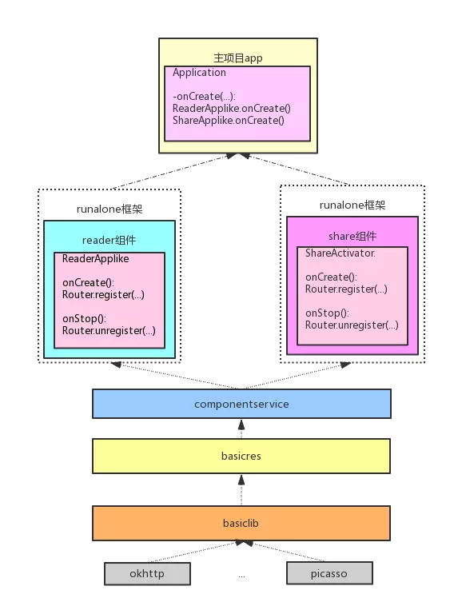

# 彻底组件化demo

[https://github.com/mqzhangw/JIMU](https://link.jianshu.com/?t=https%3A%2F%2Fgithub.com%2Fmqzhangw%2FJIMU) 

https://www.jianshu.com/p/59822a7b2fad

## JIMU的使用

首先看一下demo代码结构图,然后根据这个结构再次从单独调试(发布),组件交互,ui跳转,集成调试,代码边界和生命周期等六个方面深入分析



代码中的各个module基本和图中对应,从上到下依次是

- app是主项目,负责集成众多组件,控制组件的生命周期
- reader和share是我们拆分的两个组件
- componentservice中定义了所有的组件提供的服务
- basicres定义了全局通用的theme和color等公共资源
- basicilb是公共的基础库,一些第三方的库okhttp也统一交给basiclib来引入

图中没有体现的module有两个,一个是componentlib,这个是我们组件化的基础库,像Router/UIRouter等都定义在这里;另一个是build-gradle,这个是我们组件化编译的gragle插件,也是整个组件化方案的核心

我们在demo中要实现的场景:主项目app集成reader和share两个组件,其中reader提供一个读书的fragment给app调用,share提供一个activity来给reader调用..主项目app可以动态的添加和卸载share组件.而集成调试和代码边界是通过build-gredle插件来实现的

### 单独调试和发布

单独调试的配置与上篇一致,通过在组件工程下的gradle.properties文件中设置一个isRunAlone变量来区分不同的场景,唯一的不同点事在组件的build.gradle不需要写下面的样板代码

```java
if(isRunAlone.toBoolean()){
    apply plugin 'com.android.application'
}else{
    applu plugin 'com.android.library'
}
```

而只需要引入一个插件com.dd.comgradle,在这个插件中会自动判断apply library还是apply application.

单独调试所必须的AndroidManifest.xml,application,入口activity等类定义在src/main/runalone下面

如果组件开发并测试完成,需要发布一个release版本的aar文件到中央仓库,只需要把isRunAlone修改为false,然后运行module:assembleRelease命令就可以了.值得注意的是,发布组件是唯一需要修改isRunAlone=false的情况,即使后面将组件集成到app中,也不需要修改isRunAlone=false的情况,即保持isRunAlone=true即可.所以实际上在AndroidStudio中,是可以看到三个application工程的,随便点击一个都是可以独立运行的,并且可以根据配置引入其他需要依赖的组件

### 组件交互

在这里组件的交互专指组件之间的数据传输,在我们的方案中使用的是接口+实现的方式,组件之间完全面向接口编程

在demo中我们让reader提供一个fragment给app使用来说明,首先reader组件在componentservice中定义自己的服务

```java
public interface ReadBookService{
    Fragment getReadBookFragment();
}
```

然后在自己的组件工程中,提供具体的实现类ReadBookServiceImpl

```java
public class ReadBookServiceImpl implements ReadBookService{
    @Override
    public Fragment getReadBookFragment(){
        return new ReaderFragment();
    }
}
```

提供了具体的实现类之后,需要在组件加载的时候吧实现类注册到Router中,具体的代码在ReaderAppLike中,ReaderAppLike相当于组件的application类,这里定义了onCreate和onStop两个生命周期方法,对应组件的加载和卸载

```java
public class ReaderAppLike implements IApplicationLike{
    Router router = Router.getInstance();
    @Override
    public void onCreate(){
        router.addService(ReadBookService.class.getSimpleName(),new ReadBookServiceImpl());
    }
    
    @Override
    public void onStop(){
        router.removeService(ReadBookService.class.getSimpleName());
    }
}
```

在app中如何使用如reader组件提供的ReaderFragment呢,注意此处app是看不到组件的任何实现类的,它是能看到componentservice中定义的readbookservice,所以只能面向ReadBookService来变成.

```java
Router router = Router.getInstance();
if(router.getService(ReadBookService.class.getSimpleName()) != null){
    ReadBookService service = (ReadBookService)router.getService(ReadBookService.class.getSimpleName());
    fragment = service.getReadBookFragment();
    ft = getSupportFragmentManager().beginTransaction();
    ft.add(R.id.content,fragment).commitAllowingStateLoss();
}
```

这里需要注意的是由于组件是可以动态加载和卸载的,因此在使用ReadBookService的时候需要进行判空处理..我们看到的数据传输是通过一个中央路由器Router来实现的,这个Router的实现其实很简单,其本质就是一个HashMap,

通过上面几个步骤就可以轻松实现组件之间的交互,由于是面向接口,所以组件之间是完全解耦的,至于如何让组件之间在编译阶段不可见,是通过com.dd.comgragle实现的.

### UI跳转

页面activity的跳转也是通过一个中央路由器UIRouter来实现,不同的是这里增加了一个优先级的概念

### 集成调试

集成调试可以认为由app或者其他组件充当host的角色,引入其他相关的组件一起参与编译,从而测试整个交互流程.在demo中app和reader都可以充当host的角色.

首先我们需要在根项目的gragle.propreties中增加一个变量mainmodulename,其值就是工程中的主项目,这里是app..设置为mainmodulename的module,其isRunAlone永远是true

然后在app项目的gradle.properties文件中增加两个变量:

```java
debugComponent=readercomponent,com.mrzhang.share:sharecomponent
compileComponent=readercomponent,sharecomponent
```

其中debugComponent是运行debug的时候引入的组件,compileComponent是release模式下引入的组件.我们可以看到debugComponent引入的两个组件写法是不同的,这是因为组件引入支持两种语法,module或者modulePackage:module,前者直接引用module工程,后者使用componentrelease中已经发布的aar.

注意在集成调试中,要引入的reader和share组件是不需要把自己的isRunAlone修改为false的.我们知道一个application工程师不能直接引用另一个application工程的,所以如果app和组件都是isRunAlone=true的话在正常情况下是编译不过的.秘密就在于com.dd.comgradle会自动识别当前要调试的具体是哪个组件,然后把其他组件默认的修改为library工程,这个修改只在当次编译生效.

如何判断当前要运行的app还是哪个组件呢?这个是通过task来判断的,判断的规则如下

- assembleRelease --> app
- app:assembleRelease或者 :app:assembleRelease --> app
- sharecomponent:assembleRelease或者:sharecomponent:assembleRelease --> sharecomponent

上面的内容要实现的目的就是每个组件可以直接在AndroidStudio中run,也可以使用命令进行打包,这期间不需要修改任何配置,却可以自动引入依赖的组件.

### 代码边界

至于依赖的组件是如何集成到host中的,其本质还是直接使用compile project()或者compile modulePackage:module@aar.那么为啥不直接在build.gradle中直接引入呢,而要经过com.dd.comgradle这个插件来进行诸多复杂的操作?

如果我们直接compile组件,那么组件的所有实现类就完全暴露出来了,使用方法就可以直接引入实现类来变成,从而绕过了面向变成的约束.这样就完全失去了解耦的效果.可为前功尽弃...

那么这个问题如何解决呢?我们的解决方式还是从分析task入手,只有在assemble任务的时候才进行compile引入.这样在代码的开发期间,组件是完全不可见的,因此就杜绝了犯错误的机会.

```java
//自动添加依赖,只在运行assemble任务的时候才会添加依赖,因此在开发期间组件之间是完全感知不到的,这是做到完全隔离的关键
//支持两种语法,module或者modulePackage:module,前者之间引用module工程,后者使用componentrelease中已经发布的aar
private vodi compileComponent(AssembleTask assembleTask,Project project){
    String components;
    if(assembleTask.isDebug){
        components = (String)project.properties.get("debugComponent");
    }else{
        components = (String)project.properties.get("compileComponent");
    }
    String[] compileComponents = components.split(",");
    if(compileComponents == null || compileComponents.length == 0){
        return;
    }
    for(String str:compileComponents){
        if(str.contains(":")){
            File file = project.file("../componentrelease/"+str.split(":")[1] + "-release.aar");
            if(file.exists()){
                project.dependencies.add("compile",str+"-release@aar");
            }else{
                throw new RuntimeException(''''//);
            }
        }else{
            project.dependencies.add("compile",project.projet(":"+str));                                   
        }
    }
}
```

### 生命周期

组件化和插件化的唯一区别是组件化不能动态的添加和修改组件,但是对于已经参与编译的组件是可以动态的加载和卸载的,甚至是降维的.

首先我们看组件的加载,在打包的时候吧依赖的组件参与编译,此时你反编译apk的代码会看到各个组件的代码和资源都已经包含在包里面.但是由于每个组件的唯一入口ApplicationLike还没有执行onCreate方法,所以组件并没有把自己的服务注册到中央路由,因此组件实际上是不可达的.

在什么时候加载组件以及如何加载组件???目前com.dd.comgradle提供了两种方式,字节码插入和反射调用

- 字节码插入模式是在dex生成之前,扫描所有的ApplicationLike类,然后通过javassist在主项目的Application.onCreate中插入调用ApplicationLike.onCreate代码,这样就相当于每个组件在application启动的时候就加载起来了
- 反射调用的方式是手动在Applciation.onCreate中或者再其他合适的时机手动通过反射的方式来调用ApplicationLike.onCreate..之所以提供这种方式的原因有两个,对代码进行扫描和插入会增加编译的时间,特别在debug的时候回影响效率,并且这种模式对instant run支持不好;另一个原因是可以更灵活的控制加载或者卸载时机

这两种模式的配置是通过配置com.dd.comgradle的Extension来实现的,下面是字节码插入的模式下的配置格式,添加applicationName的目的是加快定位Application的速度

```java
combuild{
    applicationName = 'com.mrzhang.component.application.AppApplication'
    isRegisterCompoAuto = true
}
```

demo中也给出了通过反射来加载和卸载组件的实例,在app的首页有两个按钮,一个是加载分享组件,另一个是卸载分享组件,在运行时可以任意的点击按钮从而加载或卸载组件,


