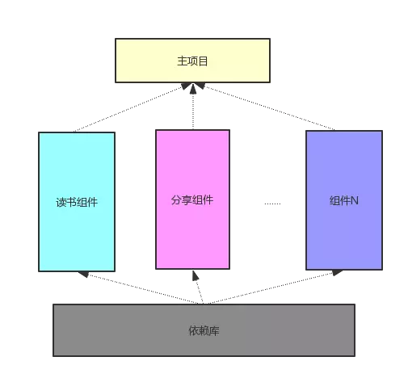
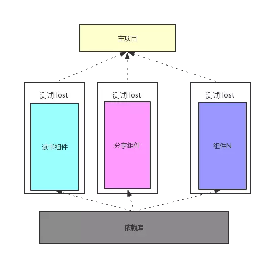
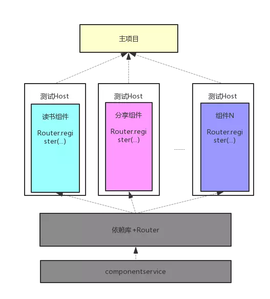
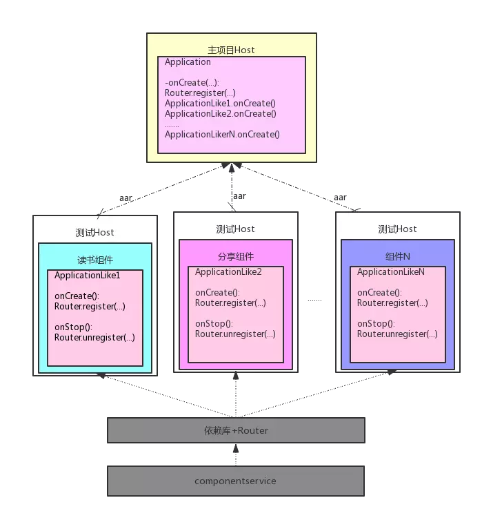

# 彻底组件化方案实践

## 模块化,组件化与插件化

模块化是一种指导概念,其核心就是分而治之,降低耦合.

组件化和插件化的区别:


​	上面的图看起来似乎比较清晰,但其实容易导致一些误解

- 组件化是一个整体吗?去了头和胳膊还能存在吗?左图中,似乎组件化是一个有机的整体,需要所有器官都健在才可以存在.而实际上组件化的目标之一就是降低整体与器官的依赖,缺少任何一个器官app都是可以存在并正常运行的
- 头和胳膊可以单独存在吗?作图也没有说明白,其实答案应该是肯定的,每个器官可以在补足一些基本功能之后都是可以独立存活的.这个是组件化的第二个目标:组件可以单独运行
- 组件化和插件化都可以用有图来表示吗?如果上面两个问题的答案都是YES的话,这个问题的答案自然也是YES..每个组件都可以看成一个单独的整体,可以按需的和其他组件整合在一起,从而完成的形成一个app
- 右图中的小机器人可以动态的添加和修改吗?如果组件化和插件化都用右图来表示,那么这个问题的答案就不一样了..对于组件化来讲,这个问题的答案是部分可以,也就是在编译期可以动态的添加和修改,但是在运行时就没法这么做了.而对于插件化,这个问题的答案很干脆,那就是完全可以,不论是在编译期还是在运行时..

`组件化和插件化的最大区别就是组件化在运行时不具备动态添加和修改组件的功能,但是插件化是可以的`

## 如何实现组件化

组件化要考虑的问题主要包括下面几个

- 代码解耦,如何将一个庞大的工程拆分成有机的整体
- 组件单独运行.每个组件都是一个完整的整体,如何让其单独运行和调试呢
- 数据传递,因为每个组件都会给其他组件提供的服务,那么主项目与组件,组件与组件之间如何传递数据?
- UI跳转:UI跳转可以人文是一种特殊的数据传递,在实现思路上有啥不同
- 组件的生命周期:我们的目标是可以做到对组件可以按需,动态的使用,因此就会涉及到组件加载,卸载和降维的生命周期
- 集成调试,在开发阶段如何做到按需的编译组件?一次调试中可能只有一两个组件参与集成,这样编译的时间就会大大降低,提高开发效率
- 代码隔离..组件之间的交互如果还是直接引用的话,那么组件之间根本没有做到解耦,如何从根本上避免组件之间的直接引用呢?也就是如何从根本上杜绝耦合的产生?只有做到这一点才是彻底的组件化

### 代码解耦

把庞大的代码进行拆分,AndroidStudio能够提供很好的支持,使用IDE的multiple module这个功能,我们可以很容易吧代码进行初步的拆分.在这里我们对两种module进行区分

- 一种是基础library,这些代码被其他组件直接引用,比如网络库可以认为是一个library
- 另一种我们称之为component,这种module是一个完整的功能模块.比如读书或者分享module就是一个component.

为了方便,我们统一把library称之为依赖库,而把component称之为组件,我们所讲的组件化也组要是针对component这种类型.而负责拼装这些组件以形成一个完整app的module,一般我们称之为主项目,主module或者Host,方便起见我们也统一称为主项目



这种拆分都是比较容易做到的,从图上看,读书,分享等都已拆分组件,并共同依赖公共的依赖库,然后这些组件都被主项目所引用.读书,分享等组件之间没有直接的联系,我们可以认为已经做到了组件之间的解耦,但是有几个问题:

- 从上面的图中,我们似乎可以认为组件只有集成到主项目才可以使用,而实际上我们的希望是每个组件是个整体,可以独立运行和调试,那么如何做到单独的调试呢
- 主项目可以直接引用组件吗?也就是说我们可以直接使用compile project(:reader)这种方式来引用组件吗?如果是这样的话,那么主项目和组件之间的耦合就没有消除..我们上面讲,组件是可以动态管理的,如果我们删掉reader这个组件,那么主项目就不能编译了.谈何动态管理呢?所以主项目对组件的直接饮用是不可以的,但是我们的reader组件最终是要打到apk里面,不仅代码要合并到classes.dex里面,资源也要经过merge操作合并到apk 的资源里面,怎么避免这个矛盾呢?
- 组件与组件之间真的没有相互引用或者交互吗>读书组件也会调用分享模块,而在这个图中根本没有体现出来,那么组件与组件之间怎么交互呢

### 组件的单独调试

其实单独调试比较简单,只需要把library换成application就可以,但是我们还需要修改一下AndroidManifest文件,因为一个单独调试需要有一个入口的activity.

我们可以设置一个变量isRunAlone,标记当前是否需要单独调试,根据isRunAlone的取值,使用不同的gradle插件和AndroidManifest文件,甚至添加Application等Java文件,以便可以做一下初始化的操作

为了避免不同组件之间资源名的重复,在每个组件的build.gragle中增加resourcePrefix "xxx_"

,从而固定每个组件的资源前缀..

```java
if(isRunAlone.toBoolean()){
    apply plugin 'com.android.application'
}else{
    apply plugin 'com.android.library'
}
////
	resourcePrefix 'readerbook_'
    sourceSets{
        main{
            if(isRunAlone.toBoolean()){
                mainfest.srcFile 'src/main/runalone/AndroidManifest.xml'
                java.srcDirs = ['src/main/java','src/main/runalone/java']
                res.srcDirs = ['src/main/res','src/main/runalone/res']
            }else{
                mainfest.srcFile 'src/main/AndroidManifest.xml'
            }
        }
    }
```

通过这些额外的代码,我们给组件搭建了一个测试Host,从而让组件的代码运行在其中,所以我们可以在优化一下我们上面的框架图



### 组件的数据传输

主项目和组件,组件和组件之间不能直接使用类的相互引用来进行数据交互.那么如何做到这个隔离呢?在这里我们采用接口+实现的结构.每个组件声明自己提供的服务Service,这些Service都是一些抽象类或者接口,组件负责将这些Service实现并注册到一个统一的路由Router中去.如果要使用某个组件的功能,只需要向Router请求这个Service的实现,具体的实现细节我们全然不关心,只要能返回我们需要的结果就可以了.这与Binder的C/S架构很相像.

因为我们组件之间的数据传递都是基于接口编程的,接口和实现是完全分离的,所以组件之间就可以做到解耦,我们可以对组件进行替换,删除等动态管理.

- 组件怎么暴露自己提供的服务呢?在项目中我们简单起见,专门建立了componentservice的依赖库,里面定义了每个组件向外提供的service和一些公共model.将所有的组件的service整合在一起,是为了在拆分初期操作更为简单,后面需要改为自动化的方式类生成..这个依赖库需要严格遵循开闭原则,以避免出现版本兼容等问题
- service具体实现是由所属组件注册到Router中的,那么是在什么时间注册的呢?这个就设计到组件的加载等生命周期,
- `避免`使用持久化的方式来传递数据,如file,sp等



### 组件之间的ui跳转

可以说ui 的跳转也是组件提供的一种特殊的服务,可以归属到上面的数据传递中去.不过一般ui的跳转我们会单独处理,一般通过锻炼的方式来跳转到具体的activity..每个组件可以注册自己所能处理的短链的scheme和host,并定义传输数据的格式.然后注册到统一的uirouter中,UIRouter通过scheme和host的匹配关系负责分发路由

UI跳转部分的具体实现是通过在每个Activity上添加注解,然后通过apt形成具体的逻辑代码.

### 组件的生命周期

由于我们要动态的管理组件,所以给每个组件添加几个生命周期状态:加载,卸载和降维.为此我们给每个组件增加一个ApplicationLike类,里面定义了onCreate和onStop两个生命周期函数

- 加载:上面讲了,每个组件负责将自己的服务实现注册到Router中,其具体的实现代码就写在onCreate方法中,那么主项目调用这个onCreate方法就称之为组件的加载,以为一旦oncreate方法执行完,组件就把自己的服务注册到Router里面去了,其他组件就可以直接使用这个服务了
- 卸载:卸载与加载基本一致,所不同的就是调用applicationlike的onStop方法,在这个方法中每个组件将自己的服务实现从Router中取消注册,
- 降维:降维使用很少.比如一个组件出现了问题,我们想把这个组件从本地改为一个web页.降维需要后台配置才生效,可以在oncreate对线上配置进行检查,如果需要降维,就把所有的ui跳转到配置的web页上面去

主项目负责加载组件,由于主项目和组件之间是隔离的,那么主项目如何调用组件ApplicationList的生命周期方法呢,目前我们采用的是基于编译器字节码插入的方式,扫描所有ApplicationLike类,然后通过javassist在主项目的onCreate中插入调用ApplicationLike.onCreate的代码


### 集成调试

每个组件单独调试通过并不意味着集成在一起没有问题,因此在开发后期我们需要把几个组件集成到一个app里面去验证.由于我们上面的机制保证了组件之间的隔离,所以我们可以任意选择几个组件参与集成.这种按需索取的加载机制可以保证在集成调试中有很大的灵活性,并且可以很大的加快编译速度.

我们的做法是这样的,每个组件开发完成后,发布一个release的aar到一个公共仓库,一般是本地maven库.然后主项目通过参数配置要集成的组件就可以了.所以我们再稍微改动一下组件与主项目之间的连接线



### 代码隔离

此时我们再回复刚开始提出的三个问题,但是还有一个隐患没有解决,就是我们可以使用compile project(xxx:reader.aar)来引入组件吗?虽然我们再数据传输章节使用了接口+实现的架构,组件之间必须针对接口变成,但是一旦我们引入了reader.aar,那我们完全可以直接使用到其中的实现类,这样我们针对接口编程的规范就成了一纸空文

我们希望只在assembleDebug或者assembleRelease的时候吧aar引入进来,而在开发阶段,所有组件都是看不到的,这样就从根本上杜绝了引用实现类的问题.我们把这个问题交给gradle来解决,我们创建一个gragle插件,然后每个组件都apply这个插件,

```java
//根据配置添加各种组件依赖,并且自动化生成组件加载代码
if(project.android instance AppExtension){
    AssembleTask assembleTask = getTaskInfo(project.gradle.startParameter.taskNames)
        if(assembleTask.isAssemble && (assenbleTask.modules.contains("all") || assembleTask.modules.contains(module))){
	//添加组件依赖
            project.dependencies.add("compile","xxx:reader-release@aar")
                //字节码插入的部分也在这里实现
        }
}

private AssembleTask getTaskInfo(List<String> taskNames){
    AssembleTask assembleTask = new AssembleTask();
    for(String task:taskNames){
        if(task.toUpperCase().contains("ASSEMBLE")){
            assembleTask.isAssemble = true;
            String[] strs = task.split(":")
            assembleTask.module.add(strs.length >1 ? strs[strs.length -2] :"all");
        }
    }
    return assembleTask;
}
```

## 组件化的拆分步骤和动态需求

### 拆分原则

组件化的拆分是个庞大的工程,特别是从几十万行代码的大工程拆分出去,锁考虑的事情千头万绪.为此我们觉得可以分成三步:

- 从产品需求到开发阶段再到运营阶段都有清晰边界的功能开始拆分,比如读书,直播模块,
- 在拆分中,造成组件依赖主项目的依赖的模块继续拆出去,比如账户体系等
- 最终主项目就是一个Host,包含很小的功能模块,以及组件之间的拼接逻辑

### 组件化的动态需求

理想的代码组织形式是插件化的方式,届时就具备了完备的运行时动态化,在向插件化迁徙的过程中,我们可以通过下面的集中方式来实现编译速度的提升和动态更新

- 在快速编译上,采用组件级别的增量编译.在抽离组件之前可以使用代码级别的增量编译工具如freeline,fasedex等
- 动态更新方面,暂时不支持新增组件等大的功能改进.可以临时采用方法级别的热修复或者功能级别的tinker等工具,tinker的接入成本较高

