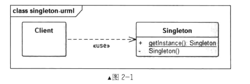
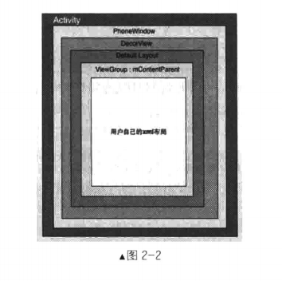

# 单例模式

## 单例模式介绍

单例模式时应用最广的模式之一,也可能是很多初几工程师唯一会使用的设计模式.在应用这个模式时,单例对象的类必须保证只有一个实例存在.许多时候整个系统只需要拥有一个全局对象,这样有利于我们协调整个系统整体的行为.如在一个应用中,应该只有一个imageloader实例,这个imageloader中又含有线程池,缓存系统,网络请求等,很消耗资源,因此,没有理由让它构造多个实例.这种不能自由构造对象的情况,就是单例模式的使用场景.

## 单例模式的定义

确保某一个类只有一个实例,而且自行定义实例化并向整个系统提供这个实例

## 单例模式的使用场景

确保某个类有且只有一个对象的场景,避免产生多个对象消耗过多的资源,或者某种类型的对象只应该有且只有一个.例如,创建一个对象需要消耗的资源过多,如要访问io和数据库等资源,这时就要考虑使用单例模式

## 单例模式UML类图



角色介绍:

- Client 高层客户端
- Singleton 单例类

实现单例模式主要有以下几个关键点

- 构造函数不对外开放,一般为private
- 通过一个静态方法或者枚举返回单例类对象
- 确保单例类的对象有且只有一个,尤其是在多线程环境下
- 确保单例类对象在反序列化时不会重新构建对象

通过将单例类的构造函数私有化,使得客户端代码不能通过new的形式手动构造单例类的对象.单例类会暴露一个公有静态方法,客户端需要调用这个静态方法获取到单例类的唯一对象,在获取这个单例对象的过程中需要确保线程安全,即在多线程环境下构造单例类的对象也是有且只有一个,这也是单例模式实现中比较困难的地方.

## 单例模式的简单示例

单例模式时设计模式中比较简单的,只有一个单例类,没有其他的层次结构与抽象.该模式需要确保该类只能生成一个对象,通常是该类需要消耗较多的资源或者没有多个实例的情况.例如,一个公司只有一个CEO,一个应用只有一个Application对象等..

```java
package...
    
public class Staff{
    public void work(){}
}

public class VP extends Staff{
    @Override
    public void work(){}
}

public class CEO extends Staff{
    private static final CEO mCeo = new CEO();
    private CEO(){}
    public static CEO getCeo(){
        return mCeo();
    }
    
    @Override
    public void work(){}
}

public class Company{
    private List<Staff> allStaffs = new ArrayList<Staff>();
    public void addStaff(Staff per){
        allStaffs.add(per);
    }
    public void showAllStaffs(){
        for(Staff per:allStaffs){
            syso(per.toString());
        }
    }
}

public class Test{
    public static void main(String[] args){
        Company cp = new Company();
        Staff ceo1 = CEO.getCeo();
        Staff ceo2 = CEO.getCeo();
        cp.addStaff(ceo1);
        cp.addStaff(ceo2);
        
        Staff vp1 = new VP();
        Staff vp2 = new VP();
        Staff staff1 = new Staff();
        Staff staff2 = new Staff();
        Staff staff2 = new Staff();
        cp.addStaff(vp1);
        cp.addStaff(vp2);
        cp.addStaff(staff1);
        cp.addStaff(staff2);
        cp.addStaff(staff3);
        
        cp.showAllStaffs();
    }
}
```

从上述代码中,CEO类不能通过new的形式构造对象,只能通过CEO.getCeo()函数来获取,而这个CEO对象是静态对象,并且在声明的时候就已经初始化,这就保证了CEO对象的唯一性.

## 单例模式的实现方式

### 懒汉模式(不建议使用)

懒汉模式是声明一个静态对象,并且在用户第一次调用getInstance时进行初始化,而上述的饿汉模式是在声明静态对象时就已经初始化.

```java
public class Singleton{
    private static Singleton instance;
    private Singleton(){}
    
    public static synchronized Singleton getInstance(){
        if(instance == null){
            instance = new Singleton();
        }
        return instance;
    }
}
```

这里,在getInstance()方法中添加了synchronized关键字,也就是getInstance时一个同步方法,这就是上面所说的在多线程情况下保证单例对象唯一性的手段.

一个问题,即使instance已经被初始化,每次调用getInstance方法都会进行同步,这样会消耗不必要的资源,这也是懒汉模式存在的最大问题.

总结

- 优点:只有在使用时才会被实例化,在一定程度上节约了资源
- 缺点
  - 第一次加载时需要实例化,反应稍慢
  - 每次调用都进行同步,造成不必要的开销

### Double Check Lock(DCL)实现单例(小概率问题)

DCL方式实现单例模式的优点是既能够在需要时才初始化单例,又能保证线程安全,且单例对象初始化后调用getInstance不进行同步锁.

```java
public class Singleton{
    private static Singleton sInstance = null;
    private Singleton(){}
    public void doSomething(){
    }
    public static Singleton getInstance(){
        if(mInstance == null){
            synchronized(Singleton.class){
                if(mInstance == null){
                    sInstance = new Singleton();
                }
            }
        }
        return sInstance;
    }
}
```

可以看到在getInstance方法中对instance进行了两次判空:

第一层判断主要是为了避免不必要的同步,第二层的判断则是为了在null的情况下创建实例.

假设线程A执行到sInstance=  new Singleton()语句,这里实际上他并不是一个原子操作,这里代码最终会被编译成多条汇编指令,大致做了3件事情:

- 给Singleton的实例分配内存
- 调用Singleton的构造函数,初始化成员字段
- 将sInstance对象指向分配的内存空间

但是,由于Java编译器允许处理器乱序执行,上面的第二和第三的顺序是无法保证的.也就是说,执行顺序可能是1-2-3也可能是1-3-2,如果是后者,并且在3执行完毕,2未执行之前,被切换到线程B上,这时候sInstance因为已经在线程A内执行过了第三点,sInstance已经是非空了,所以,线程B直接取走sInstance,在使用时就会出错,这就是DCL失效问题

在jdk1.5之后,调整了JVM,具体化了volatile关键字,因此,如果是jdk之后的版本,只需要将sInstance的定义改成volatile就可以保证sInstance对象每次都是从主内存中读取,就可以使用DCL的写法来完成单例模式.当然,volatile或多或少也会影响性能,但考虑到程序的正确性,牺牲这点性能还是值得的.

DCL;优点:资源利用率高,第一次执行getInstance时单例对象才会被实例化,效率高.缺点:第一次加载时反应稍慢,也由于Java内存模型的原因偶尔会失败.在高并发环境下也有一定的缺陷,虽然发生概率很小.

DCL是使用最多的单例实现方式,它能够在需要时才实例化单例对象,并且能够在绝大多数场景下保证单例对象的唯一性,除非你的代码在并发场景比较复杂或者低于jdk6版本下使用,否则,这种方式一般能够满足需求.

### 静态内部类单例模式(推荐使用)

DCL虽然在一定程度上解决了资源消耗,多余的同步,线程安全等问题,但是他还是在某些情况下出现失效的问题.这个问题被称为DCL失效

```java
public class Singleton{
    private Singleton(){}
    public static Singleton getInstance(){
        return SingletonHolder.sInstance();
    }
    
    private static class SingletonHolder{
        private static final Singleton sInstance = new Singleton();
    }
}
```

当第一次加载Singleton类时并不会初始化sInstance,只有在第一次调用Singleton的getInstance方法时才会导致sInstance被初始化,因此,第一次调用getInstance方法会导致虚拟机加载SinggletonHolder类,这种方式不仅能够确保线程安全,也能够保证单例对象的唯一性,同时也延迟了单例的实例化,所以这是推荐使用的单例模式实现方式.

### 枚举单例

```java
public enum SingletonEnum{
    INSTANCE;
    public void soSomething(){
        syso("so sth..");
    }
}
```

写法简单是枚举单例最大的优点,枚举在Java中与普通的类是一样的,不仅能够有字段,还能够有自己的方法.最重要的是默认枚举实例的创建是线程安全的,并且在任何情况下他都是一个单例.

在上述几种单例模式实现中,在一个情况下他们会出现重新创建对象的情况,那就是反序列化.

通过序列化将一个单例的实例对象写到磁盘,然后再读回来,从而有效地获得一个实例.即时构造函数是私有的,反序列化时依然可以通过特殊的途径去创建一个新的实例,相当于调用该类的构造函数.但序列化操作提供了一个很特别的钩子函数,类中具有一个私有的,被实例化的方法readResolve,这个方法可以让开发人员控制对象的反序列化.

上述方法中药杜绝单例对象在被反序列化时重新生成对象

```java
private Object readResolve() throws...{
    return sInstance;
}
```

也就是在readResolve方法中将sInstance对象返回,而不是默认的重新生成一个新的对象.

而枚举并不存在这个问题,因为即使反序列化它也不会重新生成新的实例

### 使用容器实现单例模式

```java
public class SingletonManager{
    private static Map<String,Object> objMap = new HashMap<String,Object>();
    private SingletonManager(){}
    public static void registerService(String key,Object instance){
        if(!objMap.containsKey(key)){
            objMap.put(key,instance);
        }
    }
    
    public static Object getService(String key){
        return ObjMap.get(key);
    }
}
```

在程序的初始,将多种单例类型注入到一个统一的管理类中,在使用时根据key获取对象对应类型的对象.这种方式使得我们可以管理多种类型的单例,并且在使用时可以通过统一的接口进行获取操作,降低了用户的使用成本,也对用户隐藏了具体实现,降低了耦合度.

## Android源码中的单例模式

在Android系统中,我们经常会通过Context获取系统级别的服务,如WindowsManagerService,ActivityManagerService等,更常用的是一个LayoutInflater类,这些服务会在何时的时候以单例的形式注册在系统中,在我们需要的时候就通过Context的getSystemService(String name)获取,

通常我们使用LayoutInflater.from(context)来获取LayoutInflater服务

```java
public static LayoutInflater from(Context context){
    LayotInflater layoutInflater = (LayoutInflater)context.getSystemService(Context.LAYOUT_INFLATER_SERVICE);
    if(layoutINflater == null){
        throw new AssertionError("LayoutInflater not found");
    }
    return layoutInflater;
}
```

可以看到from(Context)函数内部是调用的Context类的getSystemService方法,Context是抽象类

```java
public abstract class Context{
    ...
}
```

getView中使用的Context对象具体实现类时什么呢??其实在Application,activity,service中都会存在一个context对象,即context的总个数为activity个数+service个数+1个.而listview通常都是显式在actiity中,那么我们就以activity中的context来分析

我们知道,一个Activity的入口是ActivityThread的main函数,在main函数中创建一个新的ActivityThread对象,并且启动消息循环(UI线程),创建新的Activity,新的Context对象,然后将Context对象传递给Activity.

```java
public static void main(String[] args){
    //...
    Process.setArgV0("<per-initialized>");
    //主线程消息循环
    Looper.perpareMainLooper();
    //创建ActivityThread对象
    ActivityThread thread = new ActivityThread();
    thread.attach(false);
    
    if(sMainThreadHandler == null){
        sMainThreadHandler = thread.getHandler();
    }
    
    AsyncTask.init();
    //...
    Looper.loop();
    
}

private void attach(boolean system){
    sThreadLocal.set(this);
    mSystemThread = system;
    //不是系统应用的情况
    if(!system){
        ViewRootImpl.addFirstDrawHandler(new Runnable(){
            public void run(){
                ensureJitEnabled();
            }
        });
        
        android.ddm.DdmHandleAppName.setAppName("<per-initialized>",UserHandle.myUserId());
        RuntimeInit.setApplicationObject(mAppThread.asBinder());
        IActivityManager mgr = ActivityManagerNative.getDefault();
        try{
            //关联mAppThread
            mgr.attachApplication(mAppThread);
        }catch(RemoteException ex){
            //...
        }
    }else{
        //...
    }
}
```

​	在main方法中,我们创建一个ActivityThread对象后,调用了其attach函数,并且参数为false.

在attach函数中,参数为false情况下,即非系统应用,会通过binder机制与ActivityManagerService通信,并且最终调用handleLaunchActivity函数

```java
private void handleLaunchActivity(ActivityClientRecord r,Intent customIntent){
    //...
    Activity a = performLaunchActivity(r,customIntent);
    //...
}

private Activit performLaunchActivity(ActivityClientRecord r,Intent customIntent){
    //...
    Activity activity = null;
    try{
        java.lang.ClassLoader cl = r.packageInfo.getClassLoader();
        activity = mInstrumentation.newActivity(		//1.创建Activity
        cl,component.getClassName(),r.intent);
        //...
    }catch(){
        //...
    }
    
    try{
        //创建Application对象
        Application app = r.packageInfo.makeApplication(false,mInstrumentation);
        if(activity != null){
            Context appContext = createBaseContextForActivity(r,activity);
            //2.获取Context对象
            CharSequence title = r.activityInfo.loadLabel(appContext.getPackageManager());
            Configuration config = new Configuration(mCompatConfiguration);
            //3.将appContext等对象attach到activity中
            activity.attach(appContext,this,getInstrumentation(),r.token,
                           r.ident,app,r.intent,r.activityInfo,title,r.parent,
                           r.embeddedID,r.lastNonConfigurationInstances,config);
            
            //...
            //4.调用Activity的onCreate方法
            mInstrumentation.callActivityOnCreate(activity,r.state);
            //...
        }
    }catch(){
        //...
    }
    
    return activity;
}

private Context createBaseContextForActivity(ActivityClientRecord r,final Activity activity){
    //5.创建context对象,可以看到实现类是ContextImpl
    ContextImpl appContext = ContextImpl.createActivityContext(this,r.packageInfo,r.token);
    appContext.setOuterContext(activity);
    Context baseContext = appContext;
    //...
    return baseContext;
}
```

Context的实现类为ContextImpl

```java
class ContextImpl extends Context{
    //...
    //ServiceFetcher 通过getService获取服务对象
    static class ServiceFetcher{
        int mContextCacheIndex = -1;
        
        //获取系统服务
        public Object getService(ContextImpl ctx){
            ArrayList<Object> cache = ctx.mServiceCache;
            Object service;
            synchronized(cache){
                if(cache.size() == 0){
                    for(int i=0;i<sNextPerContextServiceCacheIndex;i++){
                        cache.add(null);
                    }
                }else{
                    service = cache.get(mContextCacheIndex);//从缓存中获取service对象
                    if(service != null){
                        return service;
                    }
                }
                service = createService(ctx);
                cache.set(mContextCacheIndex,service);
                return service;
            }
        }
        
        //子类复写该方法用以创建服务对象
        public Object createService(ContextImpl ctx){
            throw new RuntimeException("Not implemented");
        }
               
    }
    
    //1.service容器
    private static final HashMap<String,ServiceFetcher> SYSTEM_SERVICE_MAP = new HashMap<String,ServiceFetcher>();
    
    private static int sNextPerContextServiceCacheIndex = 0;
    
    //2.注册服务
    private static void registerService(String serviceName,ServiceFetcher fetcher){
        if(!(fetcher instanceof StaticServiceFetcher)){
            fetcher.mContextCacheIndex = sNextPerContextServiceCacheIndex++;    
        }
        SYSTEM_SERVICE_MAP.put(serviceName,fetcher);
    }
    
    //3.静态语句块,第一次加载该类时执行
    static{
        //...
        //注册LayoutInflater service
        registerService(LAYOUT_INFLATER_SERVICE,new ServiceFetcher(){
            public Object createService(ContextImpl ctx){
                return PolicyManager.makeNewLayoutInflater(ctx.getOuterContext());
            }
        })
    }
    
    //4.根据key获取对应的服务
    public Object getSystemService(Strign name){
        ServiceFetcher fetcher = SYSTEM_SERVICE_MAP.get(name);
        return fetcher == null ? null : fetcher.getService(this);
    }
    
}
```

从ContextImpl类的部分代码中可以看到,在虚拟机第一次加载该类时会注册各种serviceFetcher,其中就包含了LayoutInflater Service.将这些服务以键值对的形式存储在一个HashMap中,用户使用时只需要根据key来获取到对应的ServiceFetcher,然后通过ServiceFetcher对象的getService函数来获取具体的服务对象.当第一次获取时,会调用ServiceFetcher的createService函数创建服务对象,然后将该对象缓存到一个列表中,下次再取时直接从缓存中获取,避免重复创建对象,从而达到单例的效果.

## 无名英雄-----深入理解LayoutInflater

LayoutInflater在我们开发中扮演着重要的角色,但很多时候我们都不知道它的重要性,因为它的重要性被隐藏在了Activity,Fragment等组件的光环之下.

```java
public abstract class LayoutInflater{}
```

从上文中知道,在加载ContextImpl时会通过如下代码将LayoutInflater的ServiceFetcher注入到容器中,

```java
registerService(LAYOUT_INFLATER_SERVICE,new ServiceFetcher(){
    public Object createService(ContextImpl ctx){
        return PolicyManager.makeNewLayoutInflater(ctx,getOuterContext());
    }
})
```

这里调用了PolicyManager.makeNewLayoutInflater方法

```java
public final class PolicyManager{
    //policy实现类
    private static final String POLICY_IMPL_CALSS_NAME = "com.android.internal.policy.impl.Policy";
    
    private static final IPolicy sPolicy;
    
    static {
        //通过反射构造Policy对象
        try{
            Class policyClass = Class.forName(POLICY_IMPL_CLASS_NAME);
            sPolicy = (IPolicy)policyClass.newInstance();
        }catch...
    }
    
    private PolicyManager(){
        //这里就是创建PhoneWindow对象的地方
        public static Window makeNewWindow(Context context){
            return sPolicy.makeNewWindow(context);
        }
        
        //通过sPolicy创建LayoutInflater
        public static LayoutInflater makeNewLayoutInflater(Context context){
            return sPolicy.makeNewLayoutInflater(conetxt);
        }
    }
}
```

PolicyManager中通过反射构造了Policy实现类,这个类实现了IPolicy接口,通过这种形式将具体的policy类对外进行隐藏实现.policyManager实际上是一个代理类,具体的功能通过sPolicy对象进行实现,我们看看sPolicy对应的Policy类

```java
public class Policy implements IPolicy{
    //...
    //创建PhoneWindow,这就是Activity中Window的具体实现
    public Window makeNewWindow(Context context){
        return new PhoneWindow(context);
    }
    
    //创建LayoutInflater具体类为PhoneLayoutInflater,
    public LayoutInflater makeNewLayoutInflater(Context context){
        return new PhoneLayoutInflater(context);
    }
}
```

**真正的LayoutInflater的实现类就是PhoneLayoutInflater...**

```java
public class PhoneLayoutInflater extends LayoutInflater{
    //内置View类型前缀,
    private static final String[] sClassPrefixList = {
        "android.widget.",
        "android.webkit.",
        ...
    }
    
    //...
    @Override
    protected View onCreateView(String name,AttributeSet attrs) throws...{
        //在View名字的前面添加前缀来构造view的完整路径
        for(String prefix:sClassPrefixList){
            try{
                View view = createView(name,prefix,attrs);
                if(view != null){
                    return view;
                }
            }catch...
        }
        return super.onCreateView(name,attrs);
    }
}
```

### 一个具体的流程

- Activity的setContentView

```java
public void setContentView(View view){
    getWindow().setContentView(view);
    initActionBar();
}
```

- activity的setContentView实际上就是Windwo的setContentView,而window是一个抽象类,上面的window实际上是实现类PhoneWIndow

```java
public void setContentView(int layoutResID){
    //1.当mContentParent为空时先构建DecorView
    //并将DecorView包裹到mContentParent中
    if(mContentParent == null){
        installDecor();
    }else{
        mContentParent.removeAllViews();
    }
    //2.解析 layoutResID
    mLayoutInflater.inflate(layoutResID,mContentParent);
    //...
}
```

- Window的View层级图



我们看到mDecor中会加载一个系统定义好的布局,这个布局中又包裹了mContentParent,而这个mContentParent就是我们设置的布局,并将添加到parent区域.在PhoneWindwo的setContentView方法中也验证了这点,首先会构建mContentParent这个对象,然后通过LayoutInflater的inflate函数将制定布局的试图添加到mContentParent中.

```java
public View inflate(int resource,ViewGroup root){
    //root 不为空,则会从resource布局解析到view,并添加到root中
    return inflate(resource,root,root != null);
}

public View inflate(int resource,ViewGroup root,boolean attachToRoot){
    //获取xml资源解析器
    XmlResourceParser parser = getContext().getResources().getLayout(resource);
    try{
        return inflate(parser,root,attachToRoot);
    }finally{
        parser.close();
    }
}

//参数1为xml解析器,参数2位要解析布局的父视图,参数3是否将要解析的视图添加到父视图中
public View inflate(XmlPullParser parser,ViewGroup root,boolean attachToRoot){
    synchronized(mConstructorArgs){
        final AttributeSet attrs = Xml.asAttributeSet(parser);
        Context lastContext = (Context)mConstructorArgs[0];
        //Context对象
        mConstructorArgs[0] = mContext;
        //存储父视图
        View result = root;
        try{
            //Look for the root node;
            int type;
            //找到root元素 
            while((type = parser.next()) != XmlPullParser.START_TAG &&
                  type != XmlPullParser.END_DUCUMENT){
                //..
            }
            //..
            final String name = parser.getName();
            //1.解析merge标签
            if(TAG_MERGE.equals(name)){
                rInflate(parser,root,attrs,false);
            }else{
                //2.不是merge标签直接解析布局中的视图
                View temp;
                if(TAG_1995.equals(name)){
                    temp = new BlinkLayout(mContext,attrs);
                }else{
                    //3.这里就是通过xml的tag来解析layout跟视图
                    //name就是要解析的视图类名,如RelativeLayout
                    temp = createViewFromTag(root,name,attrs);
                }
          
                ViewGroup.LayoutParams params = null;
                if(root != null){
                    //生成布局参数
                    params = root.generateLayoutParams(attrs);
                    //如果attachToRoot为false,那么将给temp设置布局参数
                    if(!attachToRoot){
                        temp.setLayoutParams(params);
                    }
                }
                
                //解析temp视图下的所有子view
                rInflate(parser,temp,attrs,true);
                //如果ROot不为空,且attachToRoot为true,那么将tmep添加到父视图中
                if(root != null && attachToRoot){
                    root.addView(temp,params);
                }
                //如果root为空或者attachTORoot为false,那么久返回temp
                if(root == null || !attachToRoot){
                    result = temp;
                }
            }
        }
    }
    return result;
}

```

上述的inflate方法中

- 解析xml中的跟标签
- 如果根标签是merge,那么调用rInflate进行解析,rInflate会将merge标签下的所有子View直接添加到根标签中
- 如果标签是普通元素,那么运行到代码3,调用createViewFromTag对钙元素进行解析
- 调用rInflate解析temp根元素下的所有子View,并将这些子View都添加到temp下
- 返回解析到的根视图

解析单个元素的createViewFromTag,

```java
View createViewFromTag(View parent,String name,AttributeSet attrs){
    if(name.equals("view")){
        name = attrs.getAttributeValue(null,"class");
    }
    try{
        View view;
        //1.用户可以通过设置LayoutInflater的factory来自行解析View,默认这些Factory都为null
        if(mFactory2!=null){
            view= mFactory2.onCreateView(parent,name,mContext,attrs);
        }else if(mFactory != null){
            view = mFactory.onCreateView(name,mContext,attrs);
        }else{
            view = null;
        }
        //2.没有Factory的情况下通过onCreateView或者createView创建View
        if(view == null){
            //3.内置view控件的解析
            if(-1 == name.indexOf('.')){
                view = onCreateView(parent,name,attrs);
            }else{
                //4.自定义控件的解析
                view = createView(name,null,attrs);
            }
        }
        return view;
    }
}
```

createViewFromTag会将该元素的parent及名字传递过来,当这个tag的名字中没有包含'.',LayoutInflater会认为这是一个Android内置的View,

```java
<TextView
	android:id="@+id/tv"
    android:layout_width="60dp"
    android:layout_height="60dp"/>
```

这里的TextView就是xml元素的名字,因此在执行inflate时就会调用代码3处的onCreateView来解析这个TextView标签..自定义view时

```java
<com.zhoulesin.MyView
	android:id="@+id/my_view"
    android:layout_width="match_parent"
    android:layout_height="match_parent"/>
```

​	此时就会调用4的craeteView来解析该view..

​	在上文的PhoneLayoutInflater中我们知道,PhoneLayoutInflater复写了onCreateView方法,也就是代码3处,该方法就是在View标签名的前面设置了一个android.widget前缀,然后再传递给createView进行解析.也就是说内置View和自定义view最终都调用了createView进行解析.

```java
//根据完整路径的类名通过反射机制构造View对象
public final View createView(String name,String prefix,AttributeSet attrs){
    //从缓存中获取构造函数 
    Constructor<? extends View> constructor = sConstructorMap.get(name);
    Class<? extends View> clazz = null;
    try{
        //2.没有缓存构造函数
        if(constructor == null){
            //如果prefix不为null,那么构造完整的view路径,加载该类
            clazz = mContext.getClassLoader.loadClass(
            	prefix != null ? (prefix+name):name).asSubClass(View.class);
            //...
            //3.从calss中获取构造函数
            constructor = class.getConstructor(mConstructorSignature);
            //4.将构造函数存入缓存中
            sConstructorMap.put(name,constructor);
        }else{
            //...
        }
        
        Object[] args = mConstructorArgs;
        args[1] = attrs;
        //5.通过反射构造view
        final View view = constructor.newInstance(args);
        if(view instanceof ViewStub){
            //always use ourselves when inflating ViewStub later
            final ViewStub viewStub = (ViewStub)view;
            viewStub.setLayoutInflater(this);
        }
        
        return view;
    }
}
```

​	上面是解析单个view的过程.

​	而我们的窗口中是一颗视图树,LayoutInflater需要解析完这棵树,rInflate

```java
void rInflate(XmlPullParser parser,View parent,final AttributeSet attrs,boolean finishInflate){
    //1.获取树的深度,深度优先遍历
    final int depth = parser.getDepth();
    int type;
    //2.挨个元素解析
    while(((type = parser.next()) != XmlPullParser.END_TAG || parser.getDepth() > depth) && type != XmlPullParser.END_DPCUMENT){
        if(type != XmlPullParser.START_TAG){
            continue;
        }
        final String name = parser.getName();
        if(TAG_REQUEST_FOCUS.equals(name)){
            parseRequestFocus(parser,parent);
        }else if(TAG_INCLUDE.equals(name)){	//解析include标签
            parserInclude(parser,parent,attrs);
        }else if(TAG_MERGE.equals(name)){	//解析merge标签,抛出异常,因为merge标签必须为跟视图
            throw new InflateException("...")
        }else if(TAG_1995.equals(name)){
            //...
        }else {
            //3.根据元素名进行解析
            final View view = createViewFromTag(parent,name,attrs);
            final ViewGroup viewGroup = (ViewGroup)parent;
            final ViewGroup.LayoutParams params = viewGroup.generateLayoutParams(attrs);
            //递归调用进行解析,也就是深度优先遍历
            rInflate(parser,view,attrs,true);
            //将解析到的view添加到viewgroup中,也就是它的parent
            viewGroup.addView(view,params);
        }
    }
    
    if(finishInflate){
        parent.onFinishInflate();
    }
}
```

rInflate通过深度优先遍历来构造视图树,每解析到一个View元素就会递归调用rInflate,知道这条路径下的最后一个元素,然后再回溯过来将每个View元素添加到他们的parent中.通过rInflate的解析之后,整颗视图树就构建完毕了.当调用了Actiivty的onResume之后,我们通过setContentView设置的内容就会出现在我们的视野中

## 运用单例模式

ImageLoader

```java
public void initImageLoader(Context context){
    //1.使用Builder构建ImageLoader的配置对象
    ImageLoaderConfiguration config = new ImageLoaderConfiguration.Builder(context).
        //加载图片的线程数
        .threadPriority(Thread.NORM_PRIORITY -2)
        //解码图像的大尺寸,将在内存中缓存先前解码图像的小尺寸
        .denyCacheImageMultipleSizesInMemory()
        //设置磁盘缓存文件名称
        .discCacheFileNameGenerator(new Md5FileNameGenerator())
        //设置加显示图片队列进程
        .taskProcessingOrder(QueueProcessingType.LIFO)
        .writeDebugLogs()
        .build();
    //2.使用配置对象初始化ImageLoader
    ImageLoader.getInstance().init(config);
    //3.加载图片
    ImageLoader.getInstance().displayImage("url",myImageView);
}
```

​	自己的ImageLoader实现

```java
public final class ImageLoader{
    //ImageLoader实例
    private static ImageLoader sInstance;
    //网络请求队列
    private RequestQueue mImageQueue;
    //.缓存
    private volatile BitmapCache mCache = new MemoryCache();
    //图片加载配置对象
    private ImageLoaderConfig mConfig;
    //私有构造函数
    private ImageLoader(){}
    
    public static ImageLoader getInsance(){
        if(sInstance == null){
            synchronized(ImageLoader.class){
                if(sInstance == null){
                    sInstance = new ImageLoader();
                }
            }
        }
        return sInstance;
    }
    
    
    public void init(ImageLoaderConfig config){
        mConfig = config;
        mCache = mConfig.bitmapCache;
        checkConfig();
        mImageQueue = new RequestQueue(mConfig.threadCount);
        mImageQueue.start();
    }
    
    public void displayImage(ImageView view,String uri){
        
    }
    
    public void displayImage(ImageView view,String uri,ImageListener listener){
    }
    
    public void displayImage(final ImageView imageView,final String uri,final DisplayConfig config,final ImageListener listener){
        BitmapRequest request = new BitmapRequest(imageView,uri,config,listener);
        request.displayConfig = request.displayConfig != null ? request.displayConfig:mConfig.displayConfig;
        //添加到队列中
        mImageQueue.addRequest(request);
    }
}
```

ImageLoader中将构造函数私有化,使用DCL形式实现单例,


# 总结

单例模式时使用频率很高的模式,但是,由于在客户端通常没有高并发的情况,因此,选择哪种实现方式并不会有太大的影响.

##优点

- 由于单例模式在内存中只有一个实例,减少了内存开支,特别是一个对象需要频繁创建,销毁时,而且创建或销毁时性能又无法优化,单例模式的优势就非常明显
- 由于单例模式只生成一个实例.所以减少了系统的性能开销,当一个对象的产生需要比较多的资源时,如读取配置,产生其他依赖对象时,则可以通过在应用启动时直接产生一个单例对象,然后用用就驻留内存的方式解决
- 单例模式可以避免对资源的多重占用,例如一个写文件操作,由于只有一个实例存在内存中,避免对同一个资源文件的同时写操作
- 单例模式可以在系统设置全局的访问点,优化和共享资源访问,例如,可以设计一个单例类,负责所有数据表的映射处理

## 缺点

- 单例模式一般没有接口,扩展很困难,若要扩展,除了修改代码基本上没有第二种途径可以实现
- 单例对象如果持有Context,那么很容易引发内存泄漏,此时需要注意传递给单例对象的Context最好是Application Context.


